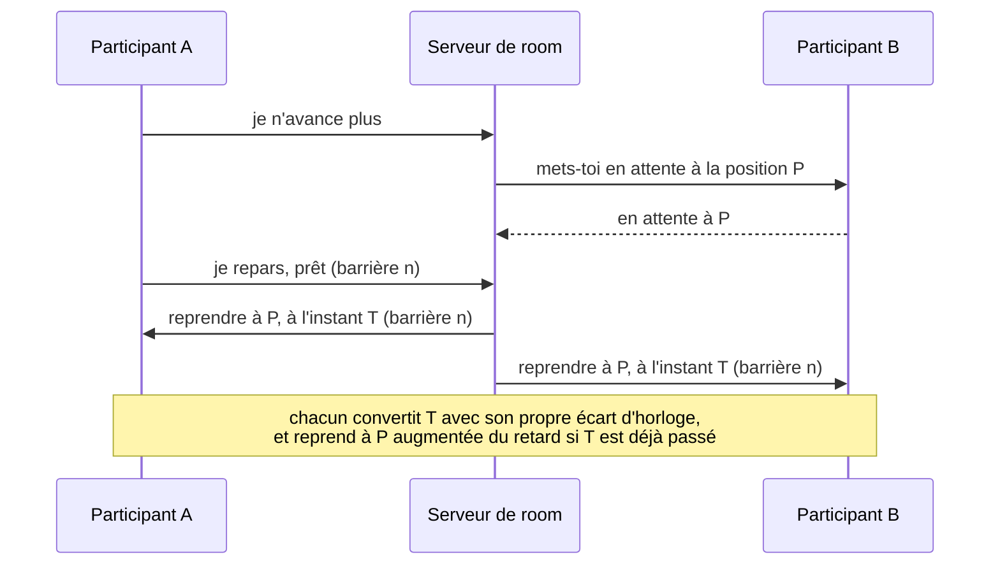
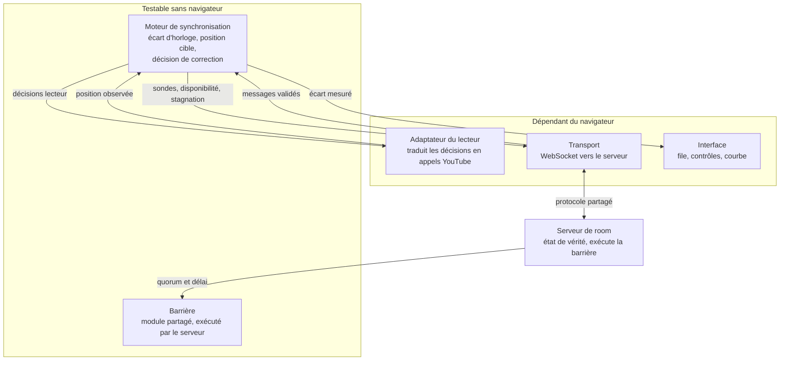
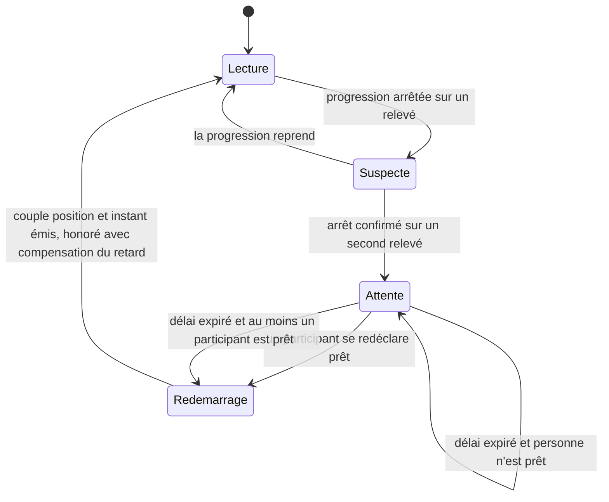

# SyncMusic - Plan

## Goal Capsule

- **Objectif** — Deux personnes qui jouent chacune chez elles écoutent la même file de musique au même instant, sans décalage audible, chacune gardant le contrôle complet de la lecture.
- **Moyen** — Deux lecteurs YouTube indépendants pilotés par une timeline autoritaire côté serveur, alignés par un rituel de départ commun. TypeScript des deux côtés.
- **Autorité produit** — Léopold, utilisateur et unique décideur.
- **Blocages ouverts** — Aucun.
- **Contrainte de forme** — L'auteur doit pouvoir expliquer le moteur de synchronisation décision par décision. Une unité qui le touche n'est pas terminée tant que ce n'est pas vrai.

**Product Contract preservation** — Restructuré, sans changement de périmètre. Trois exigences sous-spécifiées ont été précisées après relecture, sans qu'aucune décision produit change: R11 nomme désormais la position de reprise et la compensation du retard, R13 distingue l'écart entre participants de l'écart de chaque client à la timeline, et R17 dit ce qui se passe quand plus personne n'est prêt. Ces cas n'étaient pas décidés autrement, ils n'étaient pas décidés du tout.

---

## Product Contract

### Summary

Un site où deux personnes rejoignent une room par code et écoutent la même file YouTube au même instant. Chacune peut ajouter un morceau, mettre en pause, passer et revenir en arrière, et l'action s'applique aux deux. La synchronisation est mesurée et affichée, pas seulement promise.

### Problem Frame

Deux amis jouent à la PS5 chacun chez soi et veulent la même musique en fond. Aujourd'hui chacun lance la lecture de son côté sur son enceinte. Les deux appareils partent à des instants différents et dérivent ensuite, si bien qu'il n'existe aucun moment où ils écoutent réellement la même chose.

Personne n'a construit de contournement, ni testé Discord, ni tenté de compte à rebours à la voix. Ils vivent avec. La gêne est continue et de faible intensité: elle n'interrompt pas la partie, elle la rend juste moins agréable. Cette forme fixe la barre. L'échec à éviter n'est pas un incident bloquant, c'est un désagrément permanent, ce qui veut dire qu'un alignement correct à l'oreille suffit et qu'il n'y a pas de gain à viser la milliseconde.

Le projet porte une seconde motivation, assumée et non liée à l'usage: il sert de projet personnel présentable en entretien. Sa partie difficile doit donc être compréhensible et démontrable par son auteur, pas seulement fonctionnelle.

### Key Decisions

- KD1. **Source YouTube via l'IFrame Player API.** (session-settled: user-directed — chosen over Deezer, SoundCloud et Spotify: inscriptions développeur fermées chez Deezer et SDK de lecture navigateur abandonné, Premium requis chez Spotify.) Governs R5, R10.
- KD2. **Deux lecteurs indépendants synchronisés, pas un flux audio diffusé d'un poste à l'autre.** Le contrôle à distance fait partie du produit, ce qui exclut la forme haut-parleur distant. Governs R3, R8.
- KD3. **Le serveur détient l'état de vérité.** Deux participants ayant tous les deux le droit d'agir, un arbitre unique évite d'avoir à départager deux clients. Governs R9.
- KD4. **Un seul rituel de départ commun pour tous les événements.** Pub, changement de morceau, arrivée, reconnexion et reprise après pause sont le même cas: quelqu'un doit rejoindre une position à un instant donné. Governs R11.
- KD5. **Pause partagée pendant une interruption, bornée par un délai maximum.** Personne ne rate de musique; le délai empêche un client muet de figer la session sans explication. Governs R16, R17.
- KD6. **La détection se fait sur le symptôme, jamais sur la cause.** L'IFrame API n'expose aucun événement de publicité documenté, et l'existence d'un événement officieux reste à confirmer par U1; en tout état de cause une pub, une déconnexion, un onglet en veille et un chargement lent produisent le même symptôme observable. Governs R15.
- KD7. **Le moteur de synchronisation est isolé du réseau, du navigateur et de YouTube.** C'est la partie que l'auteur doit pouvoir démontrer et expliquer. Governs R21, R22.
- KD8. **La compensation de latence audio est manuelle.** La latence d'une enceinte Bluetooth n'est pas mesurable depuis l'autre bout du réseau. Governs R14.
- KD9. **Aucun compte, room éphémère.** Deux utilisateurs qui se connaissent n'ont besoin ni d'identité ni d'historique. Governs R2, R4.
- KD10. **La mesure est un livrable, pas un outil de mise au point.** Elle sert à régler les seuils sur des données et à rendre le résultat démontrable. Governs R19, R20.
- KD11. **La file accepte l'ajout et le retrait, pas le réordonnancement.** Retirer un morceau ajouté par erreur est un besoin courant et bon marché; réordonner obligerait à départager deux déplacements concurrents pour un gain faible à deux participants. Governs R6.
- KD12. **File vide: silence, plutôt que boucle ou enchaînement automatique.** Les suggestions de la plateforme dépendent du compte et de l'historique, donc les deux clients ne choisiraient pas le même morceau suivant et la synchronisation casserait par construction. Governs R7.

### Actors

- A1. **L'hôte** — crée la room et transmet le code.
- A2. **L'invité** — rejoint la room avec le code. Une fois entré, ses droits sont identiques à ceux de A1.
- A3. **Le serveur de room** — détient la file, l'état de lecture et l'instant de départ commun.

### Requirements

**Room et accès**

- R1. Un participant crée une room et reçoit un code court à partager.
- R2. Un second participant rejoint la room avec ce code, sans compte ni inscription.
- R3. Les deux participants disposent des mêmes droits; aucun n'est propriétaire de la lecture.
- R4. La room et sa file cessent d'exister une fois que tous les participants l'ont quittée.

**File de lecture et contrôle**

- R5. Chaque participant ajoute un morceau à la file depuis un lien ou un identifiant YouTube.
- R6. Chaque participant retire de la file un morceau qui n'a pas encore été joué.
- R7. Quand le dernier morceau de la file se termine, la lecture s'arrête et l'interface signale que la file est vide.
- R8. Chaque participant peut mettre en pause, reprendre, passer au suivant, revenir au précédent et se déplacer dans le morceau en cours; l'action s'applique à tous.
- R9. Le serveur détient la file et l'état de lecture, et les diffuse à tous les participants.
- R10. Le lecteur YouTube reste visible à l'écran, à la taille minimale imposée par les conditions d'utilisation de la plateforme.

**Synchronisation**

- R11. Toute reprise de lecture, quelle qu'en soit la cause, passe par un départ commun: chaque client annonce sa disponibilité, puis le serveur fixe un couple position de reprise et instant de départ, la position étant celle de la timeline autoritaire figée à l'entrée en attente.
- R12. Chaque client convertit cet instant partagé en heure locale à partir d'un écart d'horloge qu'il estime lui-même, et ne se déclare disponible qu'une fois cette estimation convergée.
- R12b. Un instant de départ déjà passé à sa réception ne fait pas reprendre à la position annoncée, mais à cette position augmentée du retard écoulé.
- R13. L'écart de lecture entre les deux participants reste sous un seuil au-delà duquel il devient audible; ce seuil est établi par la mesure et non par supposition. Il porte sur l'écart entre participants, pas sur l'écart de chacun à la timeline du serveur, dont il vaut au pire le double.
- R14. Chaque participant règle un décalage local compensant la latence de sa propre sortie audio; ce réglage est conservé sur son appareil.

**Interruptions**

- R15. Le système détecte qu'un participant n'avance plus alors qu'il devrait lire, sans chercher à en identifier la cause.
- R16. Une interruption détectée met les autres participants en attente à leur position courante.
- R17. L'attente prend fin dès que le participant interrompu est de nouveau prêt, ou à l'expiration d'un délai maximum, la lecture reprenant alors sans lui. Si aucun participant n'est prêt à cette expiration, l'attente est prolongée au lieu de relancer une lecture que personne ne peut honorer.
- R18. L'interface indique en permanence qui est en attente et depuis combien de temps.

**Mesure**

- R19. Le système mesure en continu l'écart de lecture entre participants et l'expose sous forme de courbe dans le temps.
- R20. Le système enregistre le nombre et la durée des interruptions survenues pendant une session.

**Moteur de synchronisation**

- R21. La logique de synchronisation ne dépend ni du réseau, ni du navigateur, ni de YouTube.
- R22. Cette logique s'exécute contre une horloge et un réseau simulés, sans navigateur, y compris sur des scénarios de réseau dégradé et de client lent.

### Le départ commun

Le mécanisme décrit en R11 et R12 est le même quel que soit l'événement déclencheur. C'est ce qui permet à R16 et R17 de ne pas être un cas particulier.

### Key Flows

- F1. Rejoindre une room dont la lecture est déjà en cours
  - **Déclencheur:** A2 saisit le code d'une room où un morceau joue.
  - **Acteurs:** A1, A2, A3
  - **Étapes:** A3 met A1 en attente à sa position; A2 reçoit le morceau courant et la position; A2 se positionne, attend la convergence de son estimation d'horloge, puis annonce sa disponibilité; A3 fixe le couple position et instant de départ; les deux repartent ensemble.
  - **Résultat:** A1 subit une brève attente, mais aucune reprise désalignée.
  - **Couvre:** R2, R11, R12

- F2. Un participant cesse d'avancer
  - **Déclencheur:** La position d'un participant stagne alors que l'état indique une lecture en cours. La cause peut être une publicité, une déconnexion, un onglet mis en veille ou un chargement lent; le flux est identique dans les quatre cas.
  - **Acteurs:** A1, A2, A3
  - **Étapes:** A3 constate la stagnation; A3 met les autres en attente à leur position; A3 démarre le délai maximum; à la reprise du participant ou à l'expiration du délai, A3 relance un départ commun.
  - **Résultat:** Soit tous repartent ensemble, soit la lecture repart sans le participant bloqué, qui rejoindra par le même mécanisme.
  - **Couvre:** R15, R16, R17, R18

- F3. Alimenter la file et passer au morceau suivant
  - **Déclencheur:** Un participant colle un lien YouTube, retire un morceau ajouté par erreur, puis passe au suivant.
  - **Acteurs:** A1 ou A2, A3
  - **Étapes:** A3 met la file à jour et la diffuse; au passage au suivant, A3 change le morceau courant et relance un départ commun; si la file est vide, A3 arrête la lecture au lieu d'enchaîner.
  - **Résultat:** Chaque changement de morceau réaligne les participants, ce qui borne la dérive à la durée d'un morceau.
  - **Couvre:** R5, R6, R7, R8, R9, R11

### Acceptance Examples

- AE1. Publicité courte chez l'invité
  - **Couvre R15, R16, R17, R18.**
  - **Étant donné** que les deux participants écoutent le même morceau à la même position.
  - **Quand** une publicité démarre chez A2 et dure moins que le délai maximum.
  - **Alors** A1 se met en attente à sa position, l'interface lui indique qu'il attend A2, et les deux repartent ensemble à la fin de la publicité, à la position où A1 s'était arrêté.

- AE2. Interruption qui dépasse le délai maximum
  - **Couvre R17, R18.**
  - **Étant donné** que A1 est en attente parce que A2 n'avance plus.
  - **Quand** le délai maximum expire sans que A2 soit redevenu prêt.
  - **Alors** la lecture repart chez A1 seul, et l'interface indique que A2 a été laissé en arrière et qu'il rejoindra automatiquement.

- AE3. Arrivée en cours de morceau
  - **Couvre R11, R12, R13.**
  - **Étant donné** qu'un morceau joue depuis deux minutes chez A1.
  - **Quand** A2 rejoint la room.
  - **Alors** A2 démarre à la position courante et non au début, et l'écart entre les deux après reprise reste sous le seuil de R13.

- AE4. Retrait du morceau en cours de lecture
  - **Couvre R6, R7.**
  - **Étant donné** qu'un seul morceau reste dans la file et qu'il est en cours de lecture.
  - **Quand** un participant tente de le retirer.
  - **Alors** le retrait est refusé, puisque R6 ne porte que sur les morceaux pas encore joués, et la lecture se poursuit jusqu'à la fin avant que la file soit signalée vide.

- AE6. Les deux participants calent en même temps
  - **Couvre R17.**
  - **Étant donné** que les deux participants lisent le même morceau à la même position, ce qui rend une coupure publicitaire simultanée probable plutôt que rare.
  - **Quand** aucun des deux n'avance et que le délai maximum expire.
  - **Alors** l'attente est prolongée au lieu de relancer, et la lecture ne repart que lorsque au moins un participant est de nouveau prêt.

- AE5. Enceintes de latences différentes
  - **Couvre R14.**
  - **Étant donné** que A1 écoute en filaire et A2 sur une enceinte Bluetooth.
  - **Quand** les deux clients sont parfaitement alignés du point de vue de la mesure.
  - **Alors** A2 entend malgré tout un retard, qu'il corrige avec son réglage local, et ce réglage est retrouvé à sa session suivante sans être redemandé.

### Success Criteria

- Sur un morceau entier, aucun des deux participants n'entend de décalage une fois son réglage de latence effectué.
- Une session de deux heures se déroule sans qu'aucun des deux n'ait besoin de resynchroniser à la main.
- La courbe de R19 montre que l'écart mesuré reste sous le seuil retenu pendant la quasi-totalité du temps de lecture.
- Le moteur de synchronisation se teste sans navigateur, et ses scénarios couvrent au minimum un réseau dégradé, un client lent et un instant de départ manqué.
- L'auteur peut expliquer le comportement du moteur face à un cas dégradé en s'appuyant sur ses tests, sans relire le code.

### Scope Boundaries

**Reporté**

- Réordonnancement des morceaux dans la file.
- Enchaînement automatique sur les suggestions de la plateforme quand la file se vide, qui exigerait que le serveur choisisse le morceau pour tout le monde.
- Calibration automatique de la latence de sortie par le micro.
- Plus de deux participants simultanés.
- Files ou historiques qui survivent à la fermeture de la room.
- Application mobile ou installable.
- Tests de bout en bout pilotant deux vrais navigateurs.

**Hors de l'identité du produit**

- Extraction, téléchargement ou réhébergement de l'audio côté serveur. Techniquement, cela supprimerait d'un coup les publicités, rendrait le positionnement précis et redonnerait accès à une correction fine de vitesse. C'est écarté parce que cela sort des conditions d'utilisation de YouTube, et parce qu'un dépôt public bâti là-dessus dessert l'objectif de présentation du projet.
- Suppression, masquage ou saut des publicités. Les règles de la plateforme l'interdisent explicitement; les détecter reste licite.
- Chat vocal ou textuel: la PS5 assure déjà la conversation.

---

## Planning Contract

### Key Technical Decisions

- KTD1. **Écart d'horloge estimé par échantillonnage, filtré sur l'aller-retour le plus court.** Le client envoie des sondes datées, le serveur y répond en portant ses propres horodatages de réception et de réémission, le client garde l'échantillon dont l'aller-retour est le plus bref d'une fenêtre glissante puis lisse le résultat. Le trajet le plus court est le moins pollué par l'attente en file dans le réseau, donc le plus proche d'un chemin symétrique. Le module expose aussi un état de convergence, parce qu'une estimation neuve est mauvaise exactement au moment où un arrivant en a besoin. Governs R12.
- KTD2. **Correction à trois étages: zone morte, vitesse, saut.** (session-settled: user-directed — chosen over la correction par saut seul: l'auteur veut une correction inaudible dans la plage où elle est possible.) Les seuils portent sur l'écart de chaque client à la timeline du serveur, une grandeur locale. R13 porte sur l'écart entre les deux participants, qui vaut au pire le double. Le seuil de R13 se dimensionne donc à au moins deux fois la zone morte, sans quoi deux clients à 0,9 seconde de part et d'autre de la timeline seraient à 1,8 seconde l'un de l'autre sans qu'aucun ne corrige. Governs R13.
- KTD3. **La vitesse de correction vise une fenêtre de résorption, pas la vitesse maximale.** Pour un écart D et une fenêtre cible T, la vitesse théorique est `1 + D/T`, quantifiée au multiple de 0,05 le plus proche, puis la durée d'application est recalculée en `D / |vitesse - 1|` pour résorber exactement D. Avec T de l'ordre de dix secondes, deux secondes d'écart se rattrapent à 1,20x, pas à 2x. Quand la quantification ramène la vitesse à 1,00, la division est impossible et la décision est de ne rien faire: un écart que la grille ne sait pas exprimer est un écart qu'on ne corrige pas. Governs R13.
- KTD4. **TypeScript des deux côtés, protocole décrit une seule fois.** (session-settled: user-directed — chosen over un serveur Python avec FastAPI: le protocole aurait été décrit deux fois et les deux descriptions auraient dérivé sans que rien ne le signale.) Le protocole est un module partagé, et les messages entrants sont validés à l'exécution par schéma strict, tout champ inconnu étant rejeté: les deux clients chargent la même version depuis le même déploiement, donc il n'existe aucune compatibilité ascendante à préserver et un champ mal orthographié doit échouer bruyamment.
- KTD5. **La stagnation se mesure en tenant compte de l'extrapolation locale du lecteur.** La position rapportée par l'IFrame API n'est pas une lecture de l'iframe: c'est un cache local extrapolé avec l'horloge de la page, plafonné à une seconde d'avance sur le dernier échantillon reçu. Quand les échantillons cessent, la valeur se fige silencieusement une seconde plus tard. La détection porte donc sur l'arrêt de progression observé sur au moins deux relevés consécutifs, jamais sur un relevé isolé. Instancie KD6, governs R15.
- KTD6. **Le moteur reçoit une horloge et des messages, il rend des décisions de deux natures.** Les unes vont au lecteur, les autres au transport: les sondes d'horloge, les annonces de disponibilité et les annonces de stagnation sont produites par le moteur et émises par le transport. Aucun accès direct au réseau, au DOM ni à l'API YouTube; c'est la décision qui appartient au moteur, jamais l'émission. Sans cette seconde sortie, la couche de branchement devrait décider quand une sonde part, ce qui viderait la frontière de son contenu. Governs R21, R22.
- KTD7. **La boucle de synchronisation tourne à une seconde, par conception.** Les navigateurs ralentissent les minuteries dans un onglet en arrière-plan, et l'onglet sera en arrière-plan pendant les parties. Un onglet qui émet du son audible ou tient une connexion ouverte est normalement exempté, et la conception a les deux, mais l'exemption ne couvre pas une pause partagée prolongée, sans son. Dimensionner la boucle à la seconde la rend correcte dans les deux régimes. Governs R13.
- KTD8. **La porte de visibilité ne s'applique qu'au tout premier démarrage de la session.** Les conditions d'utilisation interdisent de déclencher une lecture automatique tant que moins de la moitié du lecteur est visible. Cette règle vise le démarrage non sollicité au chargement d'une page, pas la reprise d'une lecture qu'un utilisateur a déjà lancée. Un onglet en arrière-plan ne rend donc jamais un client non prêt: sans cette restriction, aucun départ commun n'aboutirait dans le seul cas d'usage visé, et chaque changement de morceau expirerait sur le délai maximum. Governs R10, R11.
- KTD9. **Politique de referrer explicite et traitement du code d'erreur 153.** Depuis juillet 2025 le lecteur embarqué exige de recevoir l'en-tête `Referer`. Le navigateur le pose seul, sauf si une politique restrictive l'étouffe. Le serveur déclare `strict-origin-when-cross-origin` et le client traite le code 153 par un message explicite plutôt que par un échec silencieux.
- KTD10. **La vitesse de lecture est réinitialisée à chaque changement de morceau.** Le lecteur remet la vitesse à 1 au chargement d'une vidéo. Toute correction en cours est donc annulée par un changement de morceau, ce que le moteur doit savoir plutôt que subir. Governs R13.
- KTD11. **Le serveur détient seul la barrière, et chaque barrière porte un identifiant.** Le quorum de disponibilité et le délai maximum vivent côté serveur, conformément à KD3; le client se contente d'honorer le couple position et instant qu'il reçoit. Deux minuteries concurrentes expireraient à des instants différents et produiraient exactement la reprise désalignée que R11 interdit. L'identifiant incrémenté à chaque barrière permet d'ignorer une disponibilité périmée: sans lui, un « prêt » émis pour la barrière précédente peut compléter le quorum de la suivante et faire repartir tout le monde sur le morceau d'avant. Governs R11, R17.
- KTD12. **La reprise compense le retard du rituel lui-même.** Quand l'instant de départ est déjà passé à sa réception, le client reprend à la position annoncée augmentée du retard écoulé, jamais à la position brute. Avec une boucle à la seconde et une zone morte du même ordre, l'erreur injectée par le départ commun tomberait sinon exactement dans sa propre zone morte, et le mécanisme censé réaligner deviendrait la première source de dérive, à chaque changement de morceau. Governs R12b.
- KTD13. **Un refus de lecture par le navigateur se déclare, il ne se subit pas.** La politique d'autoplay des navigateurs bloque toute lecture scriptée avec son avant une interaction de l'utilisateur sur le domaine, et l'ordre de lecture n'expose aucune erreur pour le signaler. Un client bloqué ainsi ressemblerait à une stagnation permanente et serait laissé en arrière indéfiniment, sans explication. L'adaptateur vérifie donc au cycle suivant le passage effectif en lecture, et remonte une erreur nommée sinon. L'entrée dans la room passe par un geste explicite de l'utilisateur, ce qui débloque la politique pour toute la session. Governs R11.

### High-Level Technical Design

**La frontière du moteur.** Ce qui est dedans est testable sans navigateur; ce qui est dehors ne l'est pas. Le moteur rend des décisions dans les deux directions, conformément à KTD6.

**Les trois étages de correction.** Les seuils portent sur l'écart d'un client à la timeline du serveur. Les valeurs sont provisoires: U1 fixe le plancher, U7 fixe le plafond et le seuil de R13.

| Écart client-timeline | Décision | Pourquoi |
|---|---|---|
| Sous le plancher de mesure | Rien | La position rapportée est extrapolée localement; corriger ici reviendrait à corriger du bruit d'API |
| Du plancher au plafond | Vitesse selon KTD3 | Inaudible ou presque, et exact par construction |
| Au-delà du plafond | Saut | Une vitesse mettrait trop longtemps, et un écart de cette taille vient presque toujours d'une interruption que la barrière traite déjà |

L'écart entre les deux participants, celui que R13 borne et que la courbe de R19 trace, vaut au pire la somme de leurs deux écarts locaux. Le seuil de R13 se dimensionne en conséquence.

**Le cycle d'une interruption.**

### Assumptions

- Les deux participants utilisent un navigateur de bureau récent, sur des connexions domestiques ordinaires, dans le même pays. Le filtre sur l'aller-retour minimal de KTD1 suppose un chemin réseau à peu près symétrique, hypothèse qui se dégraderait sur une route intercontinentale.
- L'onglet sera fréquemment en arrière-plan, la lecture audio se poursuivant. Cette hypothèse est structurante: elle fonde KTD7 et impose la restriction de KTD8.
- Aucun bloqueur de publicité ne sera utilisé. La fréquence réelle des publicités sur un lecteur embarqué n'est documentée nulle part et n'a pas pu être mesurée; R20 la rend observable. Si l'attente s'avère trop pénible, le délai maximum peut être réduit jusqu'à un plancher non nul. Le ramener à zéro ne serait pas un réglage mais une modification du Product Contract, puisque cela retirerait tout effet observable à R16 et renverserait KD5.
- La grille de vitesses de 0,05 a été mesurée sur un navigateur, un jour donné, et n'est garantie par aucune documentation. U1 la reconfirme avant que KTD3 soit implémenté.
- La room suppose exactement deux participants. Un troisième est refusé plutôt qu'accommodé, ce qui autorise le moteur et la courbe à raisonner par paire.

### Sequencing

Le travail se lit en trois temps. La première mesure, parce que plusieurs seuils du plan sont provisoires tant qu'elle n'a pas eu lieu. La deuxième construit le cœur synchronisé et fixe les seuils que seule une écoute réelle peut produire. La troisième rend le tout robuste et le met en ligne.

---

## Implementation Units

### Phase 1 — Mesurer et poser les fondations

### U1. Banc de mesure de l'API YouTube

- **Goal** — Remplacer par des chiffres mesurés les cinq inconnues dont dépendent le plancher de correction et le contrat de l'adaptateur.
- **Requirements** — Prépare R13, R15. Ne livre aucune exigence produit.
- **Dependencies** — Aucune.
- **Files** — `spike/probe.html`, `spike/probe.js`, `docs/mesures-api-youtube.md`
- **Approach** — Une page autonome ouvrable sans étape de build, donc en JavaScript simple: l'unité précède l'outillage de U2 et doit rester hors de l'application. Elle mesure:
  1. La cadence réelle des mises à jour de position en lecture soutenue, sur dix minutes. C'est elle qui fixe le plancher de mesure du tableau des trois étages.
  2. La grille de vitesses réellement acceptée, en balayant de 0,25 à 2 par pas de 0,01 et en relisant la valeur obtenue. La vérification chronométrée que le média suit vraiment se limite à la plage effectivement produite par KTD3, soit environ 1,00 à 1,30.
  3. Ce qui change dans les données rapportées pendant une vraie publicité, sur une vidéo monétisée. Vérifier au passage si un événement d'état de publicité est émis: deux sources se contredisent sur son existence.
  4. Le comportement en onglet arrière-plan sur au moins dix minutes: cadence effective de la boucle avec et sans son audible, et vérification qu'une reprise pilotée par le code fonctionne bien onglet caché.
  5. L'écart entre position demandée et position réellement atteinte après un positionnement, dans et hors zone déjà téléchargée. La documentation annonce un recalage sur la keyframe précédente, ce que la barrière et l'étage saut supposent tous deux inexistant.
- **Execution note** — Les résultats sont consignés dans `docs/mesures-api-youtube.md`. Aucun seuil de U7 n'est figé avant.
- **Clause de repli** — Un point peut revenir non mesuré, en particulier le point 3 qui dépend d'une publicité qu'on ne déclenche pas à volonté. Dans ce cas: point 2 non mesuré fige la grille au pas de 0,05 relevé le 18 août 2026 et reporte sa validation à l'écoute de U7; point 3 non mesuré fait valider la détection de stagnation en U7 par coupure réseau simulée plutôt que par vraie publicité; point 5 non mesuré impose à U5 de relire la position après stabilisation dans tous les cas.
- **Test expectation: none** — c'est un instrument de mesure, son livrable est un document.
- **Verification** — Le document donne une valeur chiffrée à chacun des cinq points, ou nomme celui qui n'a pas pu être mesuré, pourquoi, et quelle clause de repli s'applique.

### U2. Squelette du projet et protocole partagé

- **Goal** — Un dépôt qui compile, se teste, et porte la définition unique du protocole.
- **Requirements** — Prépare R9, R11, R12, R19. Instancie KTD4.
- **Dependencies** — Aucune.
- **Files** — `package.json`, `tsconfig.json`, `vite.config.ts`, `shared/protocol.ts`, `shared/protocol.test.ts`
- **Approach** — Un seul dépôt avec trois dossiers: `shared`, `server`, `client`. TypeScript en mode strict, environnement de test DOM pour les composants. Le module partagé décrit chaque message et son schéma de validation stricte. Les familles de messages sont: room et file; contrôle de lecture; sonde d'horloge et sa réponse portant les horodatages de réception et de réémission serveur; départ commun portant identifiant de barrière, position et instant; disponibilité et rétractation portant l'identifiant de barrière; annonce de stagnation; rapport périodique de position observée par participant.
- **Test scenarios**
  - Un message conforme est accepté et son type est correctement inféré.
  - Un message avec un champ manquant est rejeté avec une erreur nommant le champ.
  - Un message avec un champ de mauvais type est rejeté.
  - Un message portant un champ inconnu supplémentaire est rejeté avec une erreur nommant le champ.
  - Une réponse de sonde porte les trois horodatages nécessaires au calcul d'écart, et l'ordre chronologique attendu est vérifié.
- **Verification** — La vérification de types et les tests passent sur un dépôt qui ne contient encore aucune fonctionnalité.

### U3. Serveur de room, barrière et diffusion

- **Goal** — Le serveur tient les rooms, la file, l'état de lecture et la barrière, et diffuse tout ce dont les clients ont besoin.
- **Requirements** — R1, R2, R3, R4, R5, R6, R7, R9, R11, R12, R17, R19. Instancie KD3, KTD11.
- **Dependencies** — U2, U4
- **Files** — `server/index.ts`, `server/room.ts`, `server/roomRegistry.ts`, `server/clockProbe.ts`, `server/room.test.ts`
- **Approach** — Une room est un objet en mémoire: code, participants, file, morceau courant, état de lecture, barrière courante avec son identifiant. Toute mutation passe par une méthode de la room, qui renvoie l'état à diffuser. Le transport est séparé de la logique, pour que la room se teste sans ouvrir de socket. Le serveur répond aux sondes d'horloge en y ajoutant ses horodatages, exécute la barrière partagée de U4 comme unique détenteur du quorum et du délai maximum, et rediffuse les positions rapportées par chaque participant, seule source de l'écart par paire. Ordonnancement: les mutations de file et de contrôle s'appliquent dans l'ordre de réception, le dernier gagnant; les messages de disponibilité font exception et sont ignorés s'ils ne portent pas l'identifiant de la barrière courante.
- **Test scenarios**
  - Créer une room renvoie un code, et deux créations successives renvoient des codes différents.
  - Rejoindre avec un code valide place le participant dans la bonne room.
  - Rejoindre avec un code inexistant échoue avec une erreur explicite.
  - Un troisième participant est refusé avec une erreur nommée room pleine.
  - Ajouter un morceau à la file le place en fin de file et diffuse la file mise à jour.
  - Retirer un morceau pas encore joué le supprime de la file. Couvre AE4.
  - Retirer le morceau en cours de lecture est refusé et laisse la file inchangée. Couvre AE4.
  - Passer au suivant quand la file est vide arrête la lecture au lieu d'enchaîner.
  - Deux actions de contrôle reçues coup sur coup laissent la room dans l'état correspondant à la seconde.
  - Une sonde d'horloge reçoit une réponse portant les horodatages de réception et de réémission.
  - Une disponibilité portant un identifiant de barrière périmé est ignorée et ne complète pas le quorum.
  - Une fermeture de socket marque le participant déconnecté sans le retirer de la room.
  - Une reconnexion pendant le délai de grâce retrouve la room et sa file.
  - La room n'est détruite qu'après le délai de grâce écoulé sans reconnexion.
- **Verification** — La logique de room se teste entièrement sans ouvrir de connexion réseau.

### Phase 2 — Le cœur synchronisé

### U4. Le moteur de synchronisation

- **Goal** — Les modules qui décident de tout, sans rien connaître de leur environnement.
- **Requirements** — R11, R12, R12b, R13, R17, R21, R22. Instancie KTD1, KTD2, KTD3, KTD6, KTD10, KTD11, KTD12.
- **Dependencies** — U2
- **Files** — `client/sync/clock.ts`, `client/sync/clock.test.ts`, `client/sync/timeline.ts`, `client/sync/timeline.test.ts`, `client/sync/corrector.ts`, `client/sync/corrector.test.ts`, `shared/sync/barrier.ts`, `shared/sync/barrier.test.ts`
- **Approach** — Quatre pièces séparées, chacune testable seule.
  1. `clock` estime l'écart avec le serveur à partir des sondes et de leurs réponses, en gardant l'aller-retour le plus court d'une fenêtre glissante, puis en lissant. Il expose son état de convergence et décide quand une sonde doit partir; il ne l'émet pas.
  2. `timeline` convertit le couple position et instant de départ, plus l'écart d'horloge, en position cible à l'instant courant, et en déduit l'écart observé. C'est la pièce qui compense le retard du rituel selon KTD12.
  3. `corrector` est une fonction pure: elle reçoit l'écart observé et les seuils, elle renvoie une décision parmi ne rien faire, appliquer telle vitesse pendant telle durée, ou sauter à telle position.
  4. `barrier` est une machine à états explicite qui gère le quorum de disponibilité, l'identifiant de barrière et le délai maximum. Elle vit dans `shared` parce que le serveur l'exécute, et reste testable sans navigateur.
  Aucun de ces fichiers n'importe quoi que ce soit du DOM, du réseau ou de YouTube.
- **Execution note** — Écrit en test d'abord: chaque scénario ci-dessous est un test qui échoue avant d'être satisfait. L'unité n'est pas terminée tant que l'auteur ne peut pas expliquer chaque décision du correcteur et le choix du filtre d'horloge.
- **Technical design** — Guidance directionnelle, pas spécification: la décision de correction se lit comme `si |écart| < plancher alors rien; sinon si |écart| < plafond alors vitesse quantifiée sur la grille, et rien si cette quantification vaut 1,00, sinon durée = |écart| / |vitesse - 1|; sinon saut`.
- **Test scenarios**
  - Sur des allers-retours réguliers, l'écart estimé converge vers l'écart réel injecté.
  - En présence d'un aller-retour anormalement long parmi les échantillons, l'estimation ne bouge pas: le filtre l'ignore.
  - Quand la latence passe brutalement de 30 à 300 millisecondes, l'estimation se réajuste sans discontinuité brutale.
  - L'état de convergence reste faux tant que trop peu de sondes ont été retenues, et devient vrai une fois la dispersion sous sa borne.
  - Un écart sous le plancher produit la décision de ne rien faire.
  - Un écart dans la bande intermédiaire produit une vitesse appartenant à la grille de 0,05, et une durée telle que le produit résorbe exactement l'écart.
  - Un écart dont la vitesse théorique se quantifie à 1,00 produit la décision de ne rien faire, sans division.
  - Un écart au-delà du plafond produit un saut.
  - Un changement de morceau pendant une correction en cours annule cette correction. Instancie KTD10.
  - Un client dont la position progresse plus lentement que l'horloge accumule un écart, et le correcteur produit une décision stable sans osciller entre étages. Couvre le cas du client lent exigé par R22.
  - Un instant de départ reçu en retard produit une position cible augmentée du retard écoulé, et non la position brute. Instancie KTD12.
  - Des positions annoncées divergentes par les deux participants produisent la position de reprise attendue, celle de la timeline figée à l'entrée en attente.
  - La barrière passe en attente quand un participant se déclare non prêt.
  - La barrière relance dès que tous les participants sont prêts. Couvre AE1.
  - La barrière relance à l'expiration du délai si au moins un participant est prêt. Couvre AE2.
  - La barrière prolonge l'attente à l'expiration du délai si aucun participant n'est prêt. Couvre AE6.
  - Une disponibilité portant un identifiant de barrière périmé ne complète pas le quorum.
  - Un participant qui rejoint pendant une attente ne relance pas prématurément la barrière.
- **Verification** — L'ensemble de la suite tourne sans navigateur et en moins d'une seconde.

### U5. Adaptateur du lecteur YouTube

- **Goal** — Une interface étroite entre le moteur et l'IFrame API, qui absorbe tous les pièges de cette API.
- **Requirements** — R8, R10, R15. Instancie KTD5, KTD8, KTD9, KTD10, KTD13.
- **Dependencies** — U1, U4
- **Files** — `client/player/playerPort.ts`, `client/player/youtubePlayer.ts`, `client/player/youtubePlayer.test.ts`
- **Approach** — `playerPort` déclare ce dont le moteur a besoin: lire une position, se positionner, régler une vitesse, jouer, mettre en pause, savoir si ça avance. `youtubePlayer` l'implémente sur l'IFrame API et porte à lui seul les particularités suivantes:
  - La position lue est un cache extrapolé localement, plafonné à une seconde. L'adaptateur expose donc aussi la fraîcheur du dernier échantillon.
  - Une position lue juste après un positionnement est un écho de la valeur demandée, pas une mesure. L'adaptateur ne la présente pas comme une observation et relit la position après stabilisation avant que le client se déclare prêt.
  - Le lecteur remet la vitesse à 1 au chargement d'un morceau; l'adaptateur le signale.
  - Le code d'erreur 153 remonte comme une erreur nommée, pas comme un silence.
  - Après tout ordre de lecture, l'adaptateur vérifie au cycle suivant le passage effectif en lecture et remonte sinon une erreur nommée de refus par le navigateur.
  - La porte de visibilité ne s'applique qu'au tout premier démarrage de la session, conformément à KTD8.
- **Test scenarios**
  - L'adaptateur signale une position figée quand aucun échantillon frais n'est arrivé depuis plus d'une seconde.
  - Une position lue immédiatement après un positionnement est marquée comme non observée.
  - Après un positionnement, la position relue après stabilisation est présentée comme observée.
  - Le chargement d'un nouveau morceau émet la remise à zéro de la vitesse.
  - Le code d'erreur 153 produit une erreur nommée et non une exception générique.
  - Un ordre de lecture qui ne produit pas le passage en lecture au cycle suivant produit l'erreur nommée de refus par le navigateur.
  - Une reprise pilotée alors que l'onglet est caché n'est pas bloquée par la porte de visibilité.
- **Verification** — Les scénarios ci-dessus tournent contre un faux lecteur; le comportement contre le vrai lecteur se vérifie à l'écoute en U7.

### U6. Interface et transport

- **Goal** — L'écran qui rend le produit utilisable, et la connexion qui le relie au serveur.
- **Requirements** — Livre R10, R18. Prépare R1, R2, R5, R6, R7, R8, que U7 ferme.
- **Dependencies** — U3
- **Files** — `client/App.tsx`, `client/transport/socket.ts`, `client/components/RoomJoin.tsx`, `client/components/Queue.tsx`, `client/components/Queue.test.tsx`, `client/components/Controls.tsx`, `client/components/PlayerFrame.tsx`, `client/components/StatusBar.tsx`, `client/components/StatusBar.test.tsx`
- **Approach** — Le lecteur occupe une place fixe et visible, jamais recouvert par un autre élément, à une taille supérieure au minimum imposé. L'entrée dans la room passe par un geste explicite de l'utilisateur, ce qui débloque la politique d'autoplay du navigateur pour toute la session, conformément à KTD13. La file affiche l'ordre de passage et le morceau en cours. La barre d'état porte qui est en attente et depuis combien de temps, en langage clair.
- **Test scenarios**
  - Coller un lien YouTube complet ou un identifiant seul produit dans les deux cas le bon identifiant.
  - Un lien qui n'est pas une vidéo YouTube est refusé avec un message compréhensible.
  - Le bouton de retrait n'apparaît pas sur le morceau en cours de lecture.
  - Quand la file est vide, l'écran l'indique et invite à ajouter.
  - Quand un participant est en attente, la barre d'état le nomme et affiche la durée écoulée.
  - Une erreur nommée de refus de lecture par le navigateur produit un message qui dit quoi faire, et non un silence.

### U7. Assemblage, seuils mesurés et première écoute

- **Goal** — Tout fonctionne ensemble, et les seuils que seule une écoute réelle peut produire sont établis.
- **Requirements** — Ferme R1, R2, R5, R6, R7, R8, R11, R12, R12b, R13. Ferme la provision du tableau des trois étages.
- **Dependencies** — U1, U3, U4, U5, U6
- **Files** — `client/sync/session.ts`, `client/sync/session.test.ts`, `client/sync/thresholds.ts`, `client/sync/driftLog.ts`, `client/sync/driftLog.test.ts`
- **Approach** — `session` est la couche de branchement: elle pousse les observations dans le moteur, émet vers le transport les messages que le moteur décide de produire, et traduit ses décisions en appels à l'adaptateur. Elle ne décide rien. `driftLog` consomme les positions rediffusées par le serveur et calcule l'écart par paire, affiché en clair pour que la porte de vérification de cette unité soit exécutable. Les seuils vivent dans un fichier unique, chacun accompagné en commentaire de la mesure ou de la justification écrite qui le fonde. Boucle à une seconde, conformément à KTD7.
- **Execution note** — Première écoute réelle à deux navigateurs. Trois seuils s'établissent ici, et nulle part ailleurs: le seuil audible de R13, en imposant un décalage croissant connu jusqu'à ce que les deux participants le remarquent; le plafond de la bande de correction par la vitesse, dérivé de ce seuil; et le caractère audible ou non d'une correction à 1,20x sur un morceau chanté, qui est la prémisse même de KTD2. Le délai maximum de R17 et le délai de grâce anti-oscillation de U8 sont fixés ici par jugement écrit, faute de mesure possible. Tous les résultats sont consignés avec ceux de U1.
- **Test scenarios**
  - Une décision de saut émise par le moteur appelle le positionnement de l'adaptateur avec la bonne valeur.
  - Une décision de vitesse applique la vitesse puis la réinitialise à l'expiration de la durée calculée.
  - Une décision d'émission produit bien un message sortant sur le transport.
  - Une observation marquée non fraîche n'est pas transmise au moteur comme une mesure.
  - Une action de contrôle émise par l'interface atteint le serveur, et l'état rediffusé met à jour les deux clients.
  - La perte du transport n'interrompt pas la boucle: le moteur continue avec sa dernière timeline connue.
  - Le journal de dérive calcule l'écart par paire à partir des positions rediffusées, et non l'écart local d'un seul client.
- **Verification** — Deux navigateurs sur la même room jouent le même morceau, et l'écart par paire affiché reste sous le seuil qui vient d'être établi.

### Phase 3 — Robustesse et mise en ligne

### U8. Détection d'interruption et pause partagée

- **Goal** — Le cas qu'aucun projet comparable ne traite.
- **Requirements** — R15, R16, R17, R18, R20. Instancie KD5, KD6, KTD5, KTD11.
- **Dependencies** — U7
- **Files** — `client/sync/stallDetector.ts`, `client/sync/stallDetector.test.ts`, `server/room.ts`, `server/room.test.ts`
- **Approach** — Le détecteur observe la progression rapportée et la fraîcheur des échantillons. Il déclare une stagnation après deux relevés consécutifs sans progression alors que l'état annonce une lecture, jamais sur un relevé isolé. Le client l'annonce, le serveur met les autres en attente et exécute la barrière. La sortie d'attente réutilise le départ commun de U4, sans code spécifique. Anti-oscillation: un participant qui vient de repartir n'est pas redéclaré en stagnation avant un délai de grâce.
- **Test scenarios**
  - Deux relevés consécutifs sans progression, en état de lecture, déclarent une stagnation.
  - Un seul relevé sans progression ne déclare rien.
  - Une pause volontaire ne déclare pas de stagnation.
  - La reprise de la progression annule la stagnation avant qu'elle soit confirmée.
  - Un participant qui vient de repartir ne redéclenche pas immédiatement une stagnation.
  - Côté serveur, une stagnation annoncée met les autres en attente à leur position courante. Couvre AE1.
  - Le délai maximum expiré relance la lecture sans le participant bloqué, s'il en reste un de prêt. Couvre AE2.
  - Les deux participants en stagnation simultanée prolongent l'attente au lieu de relancer. Couvre AE6.
  - Le participant laissé en arrière rejoint ensuite par le départ commun ordinaire.
  - Chaque interruption est enregistrée avec sa durée et son participant.
- **Verification** — La détection se valide par coupure réseau simulée, et par une vraie publicité si U1 a pu en observer une.

### U9. Calibration de latence et courbe de dérive

- **Goal** — Le réglage qui rend la synchronisation audible correcte, et la preuve chiffrée qu'elle fonctionne.
- **Requirements** — R14, R19.
- **Dependencies** — U7
- **Files** — `client/components/LatencyCalibration.tsx`, `client/components/DriftChart.tsx`, `client/components/DriftChart.test.tsx`
- **Approach** — Un réglage local en millisecondes, conservé sur l'appareil, appliqué comme décalage constant sur la position cible avant toute décision de correction. La courbe affiche dans le temps l'écart par paire déjà calculé par le journal de U7, ainsi que les interruptions. Le journal conserve tous les points de la session en mémoire, sans agrégation: une session de deux heures représente quelques milliers de valeurs, et agréger dégraderait la résolution exactement là où le critère de succès s'évalue.
- **Test scenarios**
  - Le décalage réglé déplace la position cible d'autant, et n'affecte rien d'autre.
  - Le réglage est retrouvé au chargement suivant. Couvre AE5.
  - La courbe affiche les interruptions enregistrées en plus de l'écart.
- **Verification** — La courbe d'une session d'écoute réelle montre l'écart par paire et les interruptions.

### U10. Déploiement

- **Goal** — Un lien qu'on peut envoyer à quelqu'un.
- **Requirements** — Aucune exigence produit; rend le reste utilisable hors de la machine de développement.
- **Dependencies** — U8, U9
- **Files** — `Dockerfile`, `fly.toml`, `.github/workflows/ci.yml`, `README.md`, `.gitignore`
- **Approach** — Un hébergeur qui accepte un processus long et les connexions maintenues. HTTPS obligatoire, imposé par le lecteur embarqué. La politique de referrer de KTD9 est posée au niveau du serveur. Aucune adresse locale codée en dur: l'adresse du serveur vient de la configuration. L'intégration continue se limite à la vérification de types, au linter et aux tests.
- **Approach — le README** — Il porte l'histoire du projet, pas seulement les instructions d'installation: le problème, les mesures qui ont fixé les seuils, et pourquoi la correction s'arrête là où elle s'arrête. C'est la page que lira un recruteur. Le dossier `spike/` y est présenté comme le banc de mesure qu'il est, pas laissé comme un résidu.
- **Test expectation: none** — unité de configuration et d'infrastructure; la vérification est un déploiement qui répond.
- **Verification** — Deux navigateurs sur deux machines différentes rejoignent la même room via l'adresse publique et écoutent en phase. Aucune erreur 153 n'apparaît.

---

## Verification Contract

| Porte | Commande | Portée |
|---|---|---|
| Types | `npm run typecheck` | Tout le dépôt, mode strict, aucune erreur tolérée |
| Style | `npm run lint` | Tout le dépôt |
| Tests | `npm test` | U2 à U9; doit rester sous quelques secondes au total |
| Écoute réelle | Manuelle, deux navigateurs | U7 puis U10; c'est la seule vérification de la jonction entre le moteur et le vrai lecteur, et la seule source des seuils que U1 ne peut pas mesurer |

La couverture automatique s'arrête volontairement à la frontière du navigateur. Rien ne vérifie automatiquement que les décisions du moteur atteignent correctement le lecteur YouTube: cette jonction se contrôle à l'oreille et sur la courbe de dérive. C'est un trou assumé, acceptable pour deux utilisateurs, et qui ne le serait pas sur un produit ouvert au public.

---

## Definition of Done

- Les trois portes automatiques passent.
- Deux navigateurs sur deux machines distinctes, via l'adresse publique, écoutent la même file sans décalage perceptible après réglage de latence.
- Une session de deux heures se déroule sans resynchronisation manuelle, et la courbe de dérive le montre.
- Une interruption chez un participant met l'autre en attente puis les fait repartir ensemble; une interruption trop longue laisse repartir celui qui va bien; une interruption simultanée chez les deux prolonge l'attente.
- Chaque seuil du plan renvoie soit à une mesure consignée dans `docs/mesures-api-youtube.md`, soit à une justification écrite dans `client/sync/thresholds.ts`.
- L'auteur peut expliquer, sans relire le code, le filtre d'horloge, les trois étages de correction, la compensation du retard de la barrière, et pourquoi la correction ne descend pas sous le plancher de mesure.

---

## Sources / Research

Les projets marqués *lu* ont eu leur code de synchronisation ouvert et lu directement. Les autres viennent d'une recherche déléguée: les chemins et les constantes sont fiables, les numéros de ligne sont à revérifier avant usage.

**Mesures faites sur l'API, dans un navigateur, le 18 août 2026**

- La grille de vitesses réellement acceptée par `setPlaybackRate` va de 0,25 à 2 par pas de **0,05**, et non les huit valeurs de `getAvailablePlaybackRates()`, qui décrit le menu de l'interface. `1.05` est accepté, `1.01` est ramené à 1. Cette mesure contredit la lecture littérale de la documentation et fonde KTD3. Elle date d'un jour et d'un navigateur: U1 la reconfirme.
- `getCurrentTime()` n'interroge pas l'iframe. C'est une lecture de cache local, extrapolée avec l'horloge de la page et plafonnée à une seconde au-delà du dernier échantillon reçu. Fonde KTD5 et le plancher de mesure du tableau des trois étages.
- Une position lue juste après `seekTo` renvoie exactement la valeur demandée: c'est un écho, pas une observation. Fonde le traitement correspondant en U5.
- L'interface déclarée par le lecteur embarqué compte 67 méthodes, dont aucune ne donne accès à l'état des publicités. Une seconde recherche a trouvé un projet en production utilisant un événement non documenté d'état de publicité. Les deux sources se contredisent et aucune n'a pu déclencher une vraie publicité: point 3 de U1.

**Documentation officielle**

- [IFrame Player API Reference](https://developers.google.com/youtube/iframe_api_reference) — `seekTo` se cale sur la keyframe précédente hors zone déjà téléchargée; code d'erreur 153 ajouté le 9 juillet 2025.
- [Required Minimum Functionality](https://developers.google.com/youtube/terms/required-minimum-functionality) — lecteur d'au moins 200 par 200 pixels, 480 par 270 recommandés en 16:9; aucun élément visuel devant le lecteur; lecture automatique interdite tant que moins de la moitié du lecteur est visible; identification par l'en-tête `Referer`, politique `strict-origin-when-cross-origin` recommandée. Fonde KTD8 et KTD9.
- [YouTube API Services Policies](https://developers.google.com/youtube/terms/developer-policies) — interdiction de modifier, remplacer ou bloquer les publicités, et de lire du contenu depuis un lecteur non affiché. Détecter reste licite. Fonde les limites de périmètre.
- [Ads on embedded videos](https://support.google.com/youtube/answer/132596) — aucun moyen de désactiver les publicités sur un lecteur embarqué, et aucune fréquence publiée.

**État de l'art de la synchronisation**

Aucun projet open source de synchronisation YouTube n'estime l'écart d'horloge entre les participants: tous ancrent sur l'horloge locale à la réception du message serveur. Les seules implémentations qui le font ne pilotent pas l'IFrame API. Aucun des projets examinés ne gère les publicités.

- [OpenTogetherTube](https://github.com/dyc3/opentogethertube) *(lu)* — horloge locale ancrée à la réception, aucune compensation de latence, saut au-delà de 1,0 s évalué toutes les 250 ms, jamais de correction par la vitesse. [Issue 290](https://github.com/dyc3/opentogethertube/issues/290) documente 20 à 30 secondes de désynchronisation causées par un simple décalage d'horloge entre machines.
- [SyncTube](https://github.com/RblSb/SyncTube) *(lu)* — horloge serveur, interrogation périodique, saut au-delà de 2,0 s avec une marge fixe de 0,5 s pour le buffering.
- [watchparty.me](https://github.com/howardchung/watchparty) *(lu)* — le seul à corriger YouTube par la vitesse. Référence = position du plus avancé à deux participants. Gain proportionnel plafonné à 1,10x, ce qui met 50 à 300 secondes à absorber une publicité.
- [Jellyfin SyncPlay](https://github.com/jellyfin/jellyfin-web/blob/master/src/plugins/syncPlay/core/players/PlaybackCore.js) *(lu)* — l'implémentation la plus élaborée, sur média local et non YouTube. Estimation d'horloge à quatre horodatages, filtrée sur l'aller-retour minimal parmi huit mesures, ce qui fonde KTD1. Zone morte à 60 ms, vitesse jusqu'à 3 s, saut au-delà: la structure reprise en KTD2. Deux enseignements portés par le code lui-même: la correction continue est **désactivée par défaut** depuis [novembre 2023](https://github.com/jellyfin/jellyfin-web/commit/61c8803a7120918db5040e48323862d320ec247e), et un commentaire des auteurs signale que la correction par la vitesse *sonne mal sur les chansons*.
- [CyTube](https://github.com/calzoneman/sync) — saut asymétrique, seuil de 2,0 s, diffusion toutes les 5 s.
- [Metastream](https://github.com/samuelmaddock/metastream) — écart d'horloge calculé une seule fois, sans aller-retour. Ses [issues 279](https://github.com/samuelmaddock/metastream/issues/279) et [148](https://github.com/samuelmaddock/metastream/issues/148) documentent le problème des publicités asymétriques, sans solution.
- [Syncplay](https://github.com/Syncplay/syncplay) — lecteurs locaux uniquement. Ralentissement à vitesse fixe au-delà de 1,5 s d'avance, saut au-delà de 4 s. Contrôle différé du saut à 0,5, 1 et 1,5 s, parce que certains lecteurs ignorent l'ordre.
- [OpenWatchParty](https://github.com/mhbxyz/OpenWatchParty) — estimation d'horloge filtrée puis lissée, correction en racine carrée, zone morte de 40 ms.
- [emby-watchparty](https://github.com/Oratorian/emby-watchparty) — détection de dérive côté serveur, correction envoyée seulement après deux dépassements consécutifs. Idée reprise dans le détecteur de U8.
- [Watch2Gether, réponse officielle sur les publicités](https://community.w2g.tv/t/how-does-watch2gether-handle-video-advertisements/120771) — la plateforme ne fait rien et resynchronise après coup, ce qui produit le défaut dont se plaignent ses utilisateurs: celui qui saute sa publicité ramène les autres en arrière.

Les chiffres de précision qui circulent sur Teleparty et Kosmi proviennent de contenus générés sans source primaire et ne sont pas repris ici.
