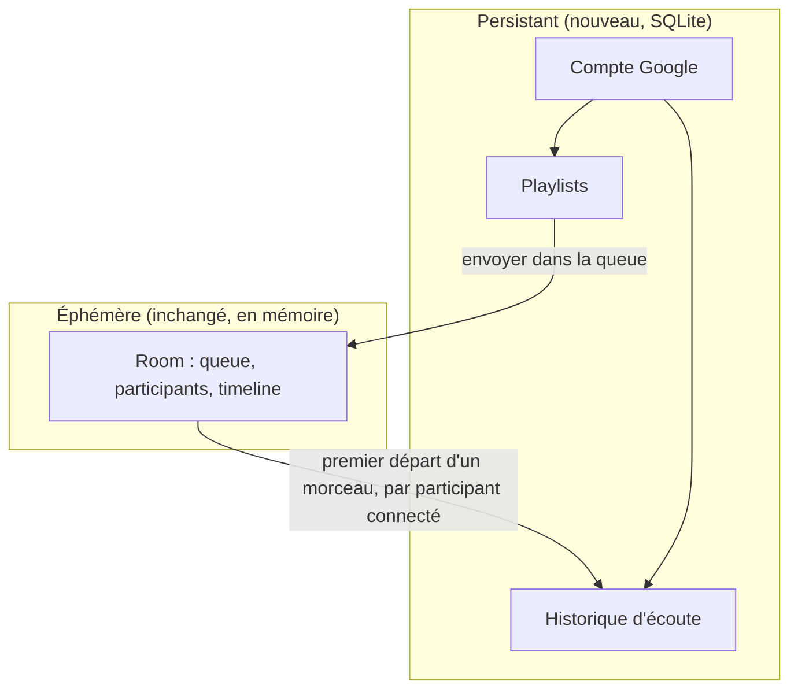
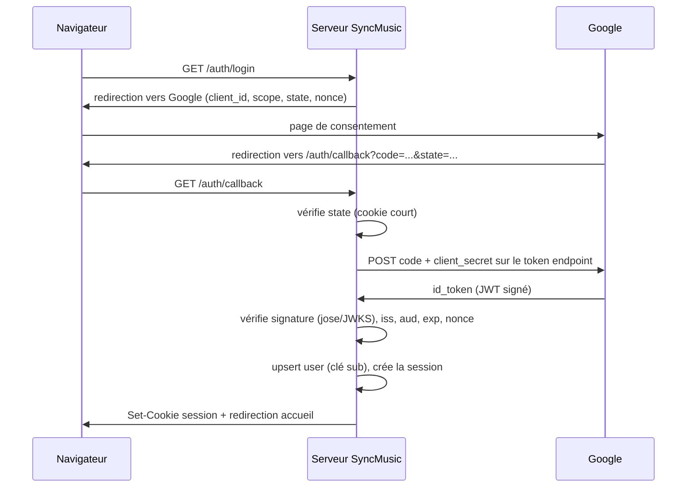
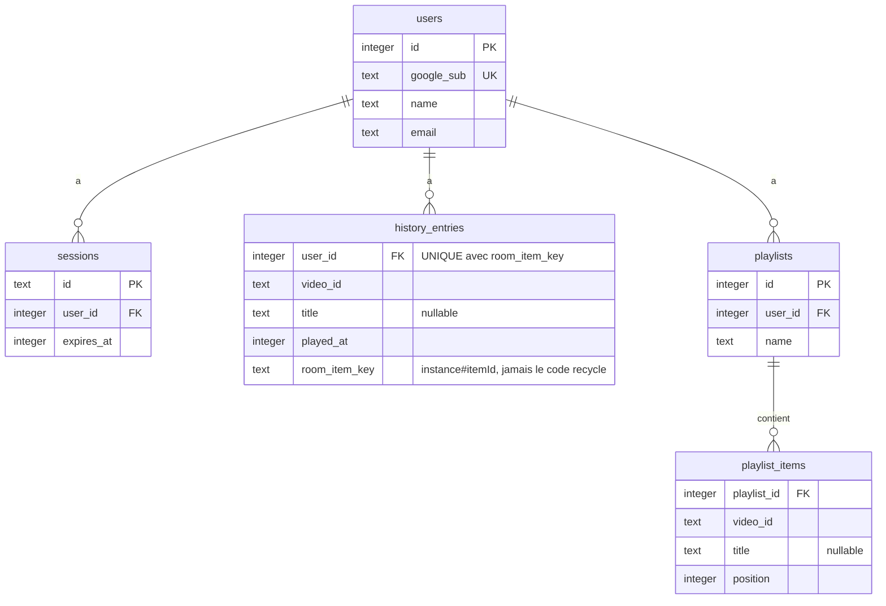

# Comptes utilisateurs et persistance - Plan

## Goal Capsule

- **Objective :** un utilisateur connecté retrouve son historique d'écoute et ses playlists d'une session à l'autre et d'un appareil à l'autre ; l'expérience invité reste exactement celle d'aujourd'hui.
- **Means :** une couche de persistance SQLite et un flow OAuth Google codé main, posés à côté des rooms éphémères sans les modifier (KTD1, KTD3).
- **Product authority :** Léopold.
- **Préalable de mise en service :** le déploiement (U10 du plan `docs/plans/2026-08-18-2025-feat-sync-music-rooms-plan.md`) est **fait depuis le 21/08/2026** — l'app tourne sur Fly.io à `https://syncmusic-leopold.fly.dev` (une seule machine, `--ha=false`, voir `docs/solutions/workflow-issues/fly-launch-reecrit-la-config.md`). L'adresse publique qu'exige OAuth existe donc. Le développement et les tests du présent plan se font en local (redirect URI `localhost` autorisée par Google).

---

## Product Contract

Product Contract preservation : changed R5 (sémantique « morceau joué » précisée, `videoId` ajouté), R8 (recherche retirée des sources V1) — confirmés en session ; ajouts KD7, R12, AE5, F1 étendu au cas d'échec.

### Summary

Ajouter un compte optionnel via Google OAuth au-dessus des rooms existantes. Se connecter débloque deux capacités persistantes : un historique des morceaux joués en room, et des playlists que l'on crée, remplit, et envoie d'un coup dans la queue d'une room.

### Problem Frame

Aujourd'hui rien ne survit à la fermeture d'une room : ni ce qu'on a écouté, ni les morceaux qu'on voudrait réécouter. Le projet reste une démo ponctuelle au lieu d'un produit qu'on a envie de rouvrir. C'est aussi le socle manquant des deux évolutions suivantes (dashboard d'écoute, recommandations IA), qui ne peuvent exister sans données accumulées.

### Key Decisions

- KD1. **Compte optionnel.** L'app reste entièrement utilisable en invité ; le compte débloque, il ne conditionne pas. (session-settled: user-approved — chosen over compte obligatoire : zéro friction pour un ami de passage ou un recruteur qui teste.) Governs R3, R9.
- KD2. **Google OAuth, seule méthode de connexion.** (session-settled: user-approved — chosen over magic link et mot de passe maison : plus simple à l'usage, et le flow OAuth est une meilleure histoire d'entretien qu'un hachage de mots de passe.) Governs R1.
- KD3. **Les rooms restent éphémères ; la persistance est une couche au-dessus.** La décision KD9 du plan d'origine (« aucun compte, room éphémère ») reste vraie pour les rooms elles-mêmes : rien ne change à leur cycle de vie, le compte observe et enregistre.
- KD4. **L'historique enregistre les morceaux joués, pas les sessions complètes.** (session-settled: user-directed — chosen over sessions complètes avec participants et durées : modèle plus lourd, reporté en extension post-V1.) Governs R5, R6.
- KD5. **Connecté, l'identité en room est le nom du compte, modifiable au niveau du compte.** Le nom vient du profil Google, se modifie dans l'écran de compte (hors room), vaut partout, et est tronqué à la limite de 20 caractères du protocole ; l'invité garde le pseudo libre. (session-settled: user-approved — chosen over renommage par room : éviterait un message de protocole pour un gain minime.) Governs R4.
- KD6. **L'invité ne laisse aucune trace, sans rétroactivité.** Pas d'historique pour les non-connectés, et créer un compte plus tard ne récupère pas le passé. (session-settled: user-approved — conséquence assumée de KD1.) Governs R10.
- KD7. **La connexion ne se fait que depuis l'écran d'accueil.** (session-settled: user-approved — chosen over connexion possible en room : la redirection OAuth ferme le WebSocket, ce qui peut détruire une room où l'on est seul et laisse un participant fantôme dans les autres cas.) Governs R1, R12.

### Requirements

**Compte et connexion**

- R1. Un visiteur peut, depuis l'écran d'accueil, se connecter avec son compte Google et se déconnecter ; la connexion survit à la fermeture du navigateur.
- R2. Un utilisateur connecté est reconnu sur n'importe quel appareil où il se connecte.
- R3. Tout ce qui existe aujourd'hui (créer une room, la rejoindre par code, écouter à deux) reste accessible sans compte, sans friction ajoutée.
- R4. En room, un utilisateur connecté apparaît sous le nom de son compte (per KD5) ; un invité saisit un pseudo libre comme aujourd'hui.
- R12. Un échec de connexion (refus du consentement, erreur Google, cookie de session invalide) ramène à l'écran d'accueil en invité, avec un message ; rien n'est perdu.

**Historique d'écoute**

- R5. L'historique reçoit au plus une entrée par morceau de la queue et par compte : elle est créée au premier départ commun de ce morceau auquel le participant connecté assiste, et porte le `videoId`, le titre (nullable, récupéré en asynchrone comme dans la queue) et la date. Les départs suivants du même morceau ne créent pas de nouvelle entrée pour ceux qui en ont déjà une ; un morceau passé rapidement compte, et un arrivant en cours de morceau gagne son entrée.
- R6. Un utilisateur connecté peut consulter son historique, du plus récent au plus ancien.
- R7. L'historique d'un utilisateur n'est visible que par lui.

**Playlists**

- R8. Un utilisateur connecté peut créer une playlist nommée et y ajouter des morceaux depuis un lien collé ou depuis son historique. (La recherche deviendra une source quand le chantier barre de recherche sera livré.)
- R9. Depuis une room, un utilisateur connecté peut envoyer une playlist entière dans la queue en une action ; les morceaux s'y comportent ensuite comme des ajouts ordinaires (retrait par n'importe quel participant, pas de démarrage automatique).

**Invités**

- R10. Un invité ne génère aucune donnée persistée : ni historique, ni trace de passage.

**Persistance**

- R11. Historique, playlists et sessions survivent aux redémarrages du serveur.

### Key Flows

- F1. Connexion
  - **Trigger :** le visiteur clique « Se connecter avec Google » sur l'écran d'accueil.
  - **Steps :** redirection vers Google ; consentement ; retour sur le serveur qui vérifie le jeton, crée la session et pose le cookie ; l'accueil s'affiche connecté sous le nom de compte. En cas de refus ou d'erreur : retour à l'accueil en invité avec un message (per R12).
  - **Covers :** R1, R2, R4, R12.
- F2. Enregistrement d'écoute
  - **Trigger :** premier départ commun d'un morceau de la queue (identifié par son `itemId`).
  - **Steps :** pour chaque participant connecté à cet instant, une entrée d'historique est créée (per R5) ; les invités présents ne génèrent rien ; un départ ultérieur du même morceau ne crée d'entrée que pour un participant qui n'en a pas encore (l'arrivant en cours de lecture).
  - **Covers :** R5, R10.
- F3. Playlist vers la room
  - **Trigger :** un utilisateur connecté, dans une room, choisit « envoyer cette playlist ».
  - **Steps :** tous les morceaux de la playlist rejoignent la queue dans l'ordre ; la lecture s'enchaîne par le mécanisme existant.
  - **Covers :** R9.

### Acceptance Examples

- AE1. **Covers R5, R10.** Léo (connecté) et un invité écoutent trois morceaux dans une room. L'historique de Léo gagne trois entrées ; l'invité n'en a nulle part, et s'il crée un compte le lendemain, son historique démarre vide.
- AE2. **Covers R5.** Léo quitte la room, deux morceaux passent, il revient pour un troisième. Son historique gagne le troisième seulement.
- AE3. **Covers R9.** Une playlist de cinq morceaux est envoyée dans une room où deux morceaux attendent déjà : la queue passe à sept, la lecture en cours n'est pas interrompue.
- AE4. **Covers R1, R11.** Le serveur redémarre. À la reconnexion, Léo retrouve son compte, son historique et ses playlists intacts.
- AE5. **Covers R5.** Pendant *Get Lucky*, une pause-reprise puis une pub provoquent deux nouveaux départs communs du même morceau. L'historique de Léo n'a toujours qu'une entrée pour ce morceau.

### Success Criteria

- Après une vraie session d'écoute à deux, chacun retrouve dans son historique ce qui a été joué.
- Un visiteur sans compte ne rencontre aucune étape nouvelle par rapport à aujourd'hui.
- Le parcours complet (connexion → écoute → historique → playlist → replay en room) est démontrable en entretien sur l'app déployée.

### Scope Boundaries

**Deferred for later**

- Sessions d'écoute complètes (avec qui, quand, combien de temps) — extension prévue de l'historique (KD4).
- Se connecter depuis l'intérieur d'une room (KD7) — demanderait un rattachement compte↔participant à travers la redirection OAuth.
- La recherche comme source de playlist — arrive avec le chantier barre de recherche.
- Partage de playlists entre utilisateurs ; gestion fine (réordonner, renommer, supprimer).
- Rate limiting dédié sur `/auth/*` — acceptable de s'en passer à l'échelle V1 ; à calquer sur le budget WS existant si besoin.
- Dashboard d'écoute et recommandations IA — chantiers suivants, construits sur ces données.

**Outside this product's identity**

- Compte obligatoire, magic link, mot de passe maison (KD1, KD2).
- Toute persistance des rooms elles-mêmes (KD3).

<!-- ce-section: work-relationships -->
### How This Work Fits Together

Ce plan possède le chantier comptes + persistance. Le découpage ci-dessous est la compréhension actuelle, pas une roadmap engagée.

- **Depends on :** U10, le déploiement de l'app actuelle — **fait** (Fly.io, `https://syncmusic-leopold.fly.dev`) ; la dépendance est levée.
- **Enables :** le dashboard d'écoute, puis les recommandations IA.
- **Can proceed independently of :** la barre de recherche YouTube (endpoint search officiel, déclenchée à l'Entrée, quota 100/jour accepté pour la V1) — décidée, non couverte ici.

### Dependencies / Assumptions

- Un projet Google Cloud (gratuit) pour les identifiants OAuth ; redirect URIs déclarées sur le même client : `http://localhost:5173/auth/callback` (dev sous Vite), `http://localhost:8787/auth/callback` (mode `npm run serve`) et l'URL HTTPS de production. La correspondance est exacte (port, chemin, slash final compris).
- `BASE_URL` est requise pour tout lancement du serveur, OAuth configuré ou non (per KTD5 et U2) — contrainte à documenter dans `docs/ecouter-a-deux.md` ; côté production, à ajouter dans `[env]` de `fly.toml` (elle remplacera l'`ALLOWED_ORIGIN` actuel, per KTD5).
- L'hébergement est désormais connu : Fly.io. Le fichier SQLite exigera un volume persistant (`fly volumes create`) et un `[mounts]` dans `fly.toml` — la VM actuelle n'a aucun disque qui survit aux redéploiements.
- Hypothèse d'échelle V1 : une poignée d'utilisateurs réels ; aucun objectif de charge.

### Sources / Research

- `docs/plans/2026-08-18-2025-feat-sync-music-rooms-plan.md` — KD9 (« aucun compte, room éphémère »), que KD3 précise sans contredire.
- État vérifié du code : aucune couche de persistance (`package.json`, `server/roomRegistry.ts`) ; seule persistance client, le pseudo et la latence en localStorage (`client/App.tsx`) ; identité de participant régénérée à chaque connexion (`server/index.ts`).
- Flow OAuth serveur et OIDC Google (officiel, vérifié 2026, non déprécié — seule la vieille lib JS `gapi.auth2` l'est) : `developers.google.com/identity/openid-connect/openid-connect` ; endpoints par le discovery document `accounts.google.com/.well-known/openid-configuration`.
- Authentification de l'upgrade WebSocket : la doc `ws` déconseille `verifyClient` au profit de l'événement `upgrade` du serveur HTTP ; risque CSWSH et contrôle du header `Origin` : OWASP WebSocket Security Cheat Sheet.
- `node:sqlite` : sans flag depuis Node 22.13 (présent : 22.22.3), étiqueté expérimental jusqu'à Node 26 ; API calquée sur `better-sqlite3`.

---

## Planning Contract

### Key Technical Decisions

- KTD1. **Flow OAuth « authorization code » par redirection, codé main, sans JavaScript Google côté client.** Trois échanges HTTP stables depuis dix ans ; la lib de bouton Google (GIS/FedCM) a changé de comportement deux fois depuis 2024 et ne couvre pas Safari. `state` et `nonce` obligatoires ; PKCE en durcissement optionnel (non documenté par Google pour les clients confidentiels). (session-settled: user-approved — chosen over la lib de bouton Google : stabilité et valeur pédagogique.) Governs R1, R12.
- KTD2. **Vérification du jeton d'identité avec `jose`.** Seule dépendance ajoutée : zéro dépendance transitive, gère le cache et la rotation des clés Google (JWKS). (session-settled: user-approved — chosen over `google-auth-library`, plus lourde que le projet entier, et over la vérification maison, risquée sur la rotation de clés.)
- KTD3. **Persistance en SQLite via `node:sqlite`, migrations maison.** Zéro dépendance, API synchrone adaptée au serveur mono-processus. Migrations : tableau ordonné de scripts SQL appliqués selon `PRAGMA user_version`, en transaction. À l'ouverture : `journal_mode = WAL` et `foreign_keys = ON`. (session-settled: user-approved — chosen over `better-sqlite3` (dépendance native) et over Postgres (un serveur de plus pour deux utilisateurs).) Governs R11.
- KTD4. **Sessions opaques côté serveur.** Identifiant de 128 bits tiré de `crypto.randomBytes`, régénéré à chaque connexion ; la base stocke `SHA-256(identifiant)`, jamais l'identifiant brut — une fuite du fichier `.db` ou d'un backup ne livre aucune session utilisable. Cookie `HttpOnly; SameSite=Lax; Path=/`, préfixe `__Host-` et `Secure` quand `BASE_URL` est en https (Safari refuse `Secure` sur `http://localhost`) ; durée glissante ~60 jours, plafonnée à ~180 jours depuis la connexion. (session-settled: user-approved — chosen over JWT : révocable en supprimant une ligne, pas de clé de signature à gérer.) Governs R1, R2.
- KTD5. **Identité du socket établie à l'upgrade.** Le handler `upgrade` du serveur HTTP existant parse le header `Cookie`, valide la session, contrôle le header `Origin`, puis passe la main à `ws` ; pas de `verifyClient` (déconseillé par la doc `ws`). L'origine autorisée est dérivée de `BASE_URL` — obligatoire à tout lancement du serveur (session-settled: user-directed — chosen over une branche permissive sans `BASE_URL` : une variable requise avec message clair est plus simple qu'un comportement conditionnel) — et une origine absente ou étrangère est refusée à l'upgrade (défense CSWSH). Absence ou invalidité de cookie = invité, jamais une erreur. Governs R3, R4, R12.
- KTD6. **Enregistrement d'historique au point de diffusion du départ commun, dédupliqué par contrainte UNIQUE.** Le serveur sait, au moment où il diffuse un départ commun, quel `itemId` est courant et quels participants sont connectés et authentifiés ; l'écriture porte une contrainte composite `UNIQUE(user, roomInstance, itemId)` et ignore les doublons — la déduplication est garantie par la base, pas par de la logique. `roomInstance` est un identifiant d'instance de room généré à la création et jamais recyclé : le code à 4 lettres se réattribue après sweep et ne doit jamais entrer dans une clé persistée, sous peine de rejeter une écoute légitime comme faux doublon des mois plus tard. Governs R5, R10.
- KTD7. **Le compte est clé sur le claim `sub` de Google, en TEXT.** L'email et le nom sont des données d'affichage mutables, rafraîchies à chaque connexion (l'email peut changer, `sub` jamais) ; le nom modifié par l'utilisateur (KD5) n'est alors plus écrasé par le rafraîchissement.
- KTD8. **Historique et playlists passent par des routes HTTP JSON, pas par le WebSocket.** Ces données sont liées au compte (cookie), pas à la room ; des routes `GET/POST` sur le serveur existant sont plus simples à tester et laissent le protocole WebSocket aux seuls messages de room. Seul « envoyer la playlist » traverse le WebSocket (un message, côté room). Governs R6, R7, R8, R9.
- KTD9. **Toute entrée persistée est bornée et validée.** La borne WS existante (16 Ko, 200 messages/10 s) ne couvre pas les nouvelles routes HTTP ni l'accumulation en base : body JSON plafonné à 16 Ko (symétrique du WS) et validé par Zod, nom de playlist ≤ 100 caractères, titre ≤ 200, ≤ 500 items par playlist, ≤ 50 playlists par compte, et un plafond de queue (~100) que `send_playlist` ne peut pas dépasser — refus propre au-delà. Sans ces bornes, un seul compte peut faire exploser la mémoire de la room en un message. Governs R8, R9, R11.

### High-Level Technical Design

Le flow de connexion (KTD1, KTD2, KTD4) :

Le modèle de données (KTD3, KTD6, KTD7) :

Le schéma exact (types, index) reste à la main de l'implémenteur ; le diagramme fixe les entités et la clé de déduplication.

---

## Implementation Units

### U1. Couche de persistance SQLite

- **Goal :** une base SQLite ouverte au démarrage du serveur, avec migrations et les cinq tables du modèle.
- **Requirements :** R11 (per KTD3).
- **Dependencies :** aucune.
- **Files :** `server/db.ts`, `server/db.test.ts`, `server/index.ts` (ouverture au démarrage), `.gitignore` (le fichier `.db` et ses sidecars WAL).
- **Approach :**
  1. Module `db.ts` : ouverture (`node:sqlite`, chemin depuis `DB_PATH`, défaut `data/syncmusic.db`), pragmas, migrations par `PRAGMA user_version`.
  2. Fonctions d'accès nommées par usage (upsert d'utilisateur, création/lecture de session, écriture d'historique, CRUD playlists) plutôt qu'un DAO générique — même esprit que `roomRegistry.ts`. Prepared statements partout, jamais d'interpolation de valeurs dans le SQL.
  3. En test, base en mémoire (`:memory:`). `DB_PATH` ne doit jamais pointer sous `dist/` (le handler statique confine déjà, ceinture en plus).
- **Patterns to follow :** `server/roomRegistry.ts` (factory + injection testable), commentaires en français qui portent le pourquoi.
- **Test scenarios :**
  - Migrations : base vide → toutes les tables existent, `user_version` au dernier numéro ; réouverture → aucune migration ne se rejoue.
  - `foreign_keys` : supprimer un user supprime (ou refuse, selon le choix ON DELETE) ses sessions, historique, playlists — le comportement choisi est testé.
  - Upsert user : même `sub` deux fois → une seule ligne, email/nom rafraîchis ; nom modifié par l'utilisateur non écrasé (per KTD7).
  - Historique : deux insertions même (user, room_item_key) → une seule ligne, pas d'erreur (per KTD6).
- **Verification :** `npm run typecheck` et `npm run test` verts ; le serveur démarre et crée le fichier de base.

### U2. Flow OAuth et sessions HTTP

- **Goal :** `/auth/login`, `/auth/callback`, `/auth/logout` et `GET /api/me` fonctionnels ; une session en cookie après consentement Google.
- **Requirements :** R1, R2, R12 (per KTD1, KTD2, KTD4).
- **Dependencies :** U1.
- **Files :** `server/auth.ts`, `server/auth.test.ts`, `server/index.ts` (routage : ces chemins passent avant le handler statique), `vite.config.ts` (proxy dev étendu à `/api` et `/auth`, même cible que `/ws`), `package.json` (`jose`), `docs/ecouter-a-deux.md` (variables d'environnement).
- **Approach :**
  1. Config par env : `BASE_URL` **obligatoire** (le serveur refuse de démarrer sans, avec un message clair — elle sert la redirect URI, jamais dérivée du header `Host`, et l'origine autorisée de KTD5) ; `GOOGLE_CLIENT_ID` et `GOOGLE_CLIENT_SECRET` optionnels : sans eux, les routes d'auth répondent 404 et l'app reste 100 % invité (R3 vaut aussi pour un déploiement sans OAuth configuré). En dev sous Vite, `BASE_URL` est l'origine réellement naviguée (`http://localhost:5173`), avec la redirect URI correspondante déclarée chez Google en plus de celle du mode `npm run serve`.
  2. `/auth/login` : génère `state` + `nonce`, les pose en cookie court (10 min, `HttpOnly; SameSite=Lax` explicite — le retour de Google est une navigation cross-site, `Strict` casserait le callback en silence ; `Secure`/`__Host-` comme la session), redirige vers l'endpoint d'autorisation (découvert via le discovery document, en dur avec commentaire).
  3. `/auth/callback` : vérifie `state` puis **efface son cookie (usage unique)**, échange le code, vérifie l'`id_token` avec `jose` (`iss` = les deux formes acceptées par Google, `aud`, `exp`, `nonce`), upsert user, crée la session, pose le cookie (per KTD4), redirige vers `/`. Toute erreur ou refus → redirection `/?auth=failed` (R12). Destinations de redirection fixes (`/`, `/?auth=failed`) — ne jamais introduire de paramètre `return_to` sans validation stricte.
  4. `/auth/logout` en **POST** (un GET serait déclenchable par n'importe quel site via une image) : supprime la session en base, expire le cookie. `POST /api/name` (session requise, ≤ 20 caractères) porte le nom modifiable de KD5.
  5. `GET /api/me` : `{ name }` si session valide, 401 sinon — c'est ce que le client interroge au chargement.
  6. Règles transverses du routeur JSON : body plafonné et validé Zod (per KTD9), contrôle `Origin`/`Sec-Fetch-Site` sur tous les POST, `Cache-Control: no-store` sur `/api/*` (l'historique est privé, R7), et jamais de `code`, `id_token`, `client_secret` ou cookie de session dans les logs, même en chemin d'erreur.
- **Execution note :** commencer par un test d'intégration qui stubbe le token endpoint de Google et signe un JWT de test contre un JWKS local — tout le chemin de vérification s'exerce sans réseau.
- **Patterns to follow :** `server/static.ts` (handler HTTP écrit main, confinement soigné), `server/videoTitle.ts` (fetch sortant avec timeout).
- **Test scenarios :**
  - Happy path : callback avec code valide (token endpoint stubbé) → session en base, cookie posé, redirection `/`.
  - `state` absent ou différent du cookie → aucun échange, redirection `/?auth=failed`.
  - Covers R12 : `error=access_denied` dans le callback (refus utilisateur) → redirection `/?auth=failed`, aucune session créée.
  - `id_token` signé par une autre clé, `aud` étranger, ou `exp` passé → rejet, `/?auth=failed`.
  - Cookie de session falsifié ou expiré sur `/api/me` → 401, jamais d'erreur 500.
  - Rejouer le même callback deux fois → le second échoue (cookie `state` à usage unique).
  - Logout → la session ne vaut plus rien immédiatement.
  - `POST /api/name` avec un nom de 21 caractères ou sans session → rejet.
- **Verification :** parcours manuel complet en local contre le vrai Google (redirect URI localhost) une fois les identifiants créés.

### U3. Identité sur le WebSocket

- **Goal :** une connexion WebSocket porteuse d'un cookie de session valide est associée au compte ; le nom du compte remplace le pseudo en room.
- **Requirements :** R3, R4 (per KTD5, KD5).
- **Dependencies :** U2.
- **Files :** `server/index.ts` (handler `upgrade`), `shared/protocol.ts` (le participant du `room_state` porte son nom, inchangé ; seul le remplissage change), `server/index.test.ts` si un test de transport existe, sinon tests dans `server/auth.test.ts`.
- **Approach :**
  1. Passer le `WebSocketServer` en `noServer: true` ; sur l'événement `upgrade` du serveur HTTP : contrôle du header `Origin` dérivé de `BASE_URL` (per KTD5 — remplace l'`ALLOWED_ORIGIN` optionnel actuel, qu'on peut oublier en prod), parse du cookie, lookup de session, puis `handleUpgrade` avec le compte (ou null) attaché à la `Session` du transport.
  2. Connecté, le nom envoyé dans `create_room`/`join_room` est ignoré au profit du nom de compte tronqué à 20 caractères (la borne du protocole) ; invité, comportement actuel inchangé.
  3. Le client masque le champ pseudo quand `/api/me` répond connecté.
- **Patterns to follow :** le handler `upgrade` et les garde-fous existants de `server/index.ts` (cap de payload, budget de messages).
- **Test scenarios :**
  - Upgrade sans cookie → connexion acceptée, participant invité (R3).
  - Upgrade avec session valide → le `room_state` montre le nom du compte, tronqué s'il dépasse 20 caractères.
  - Upgrade avec `Origin` étranger → socket refusée (401 + destroy), avec ou sans cookie.
  - Session révoquée entre login et upgrade → invité, pas d'erreur.
- **Verification :** deux fenêtres en local, l'une connectée l'autre invitée, les deux noms corrects dans la room.

### U4. Client : connexion et écran de compte

- **Goal :** bouton « Se connecter avec Google » sur l'accueil, affichage connecté, écran de compte avec nom modifiable, message d'échec.
- **Requirements :** R1, R4, R12 (per KD5, KD7).
- **Dependencies :** U2.
- **Files :** `client/App.tsx`, `client/components/AccountBar.tsx`, `client/components/AccountBar.test.tsx`, `client/styles.css`, `package.json` (`react-router-dom`).
- **Approach :**
  0. Navigation par react-router (session-settled: user-directed — chosen over un état d'écran maison ou un hash d'URL : standard des apps propres, retour navigateur et F5 fonctionnels) : routes `/`, `/compte`, `/historique`, `/playlists`. La room reste sous `/`, pilotée par l'état de connexion comme aujourd'hui — pas d'URL de room en V1. Les écrans de U5 et U6 s'y accrochent.
  1. Au chargement, `fetch('/api/me')` fixe l'état connecté/invité.
  2. Accueil seulement (per KD7) : bouton connexion (lien vers `/auth/login`) ou nom + menu (compte, déconnexion). Aucun bouton d'auth dans l'écran room.
  3. `?auth=failed` dans l'URL → message éphémère (pattern des erreurs existantes de `App.tsx`), puis nettoyage de l'URL.
  4. Écran de compte : champ nom (POST vers `POST /api/name`, persisté per KD5) envoyé par un bouton « Enregistrer » ou la touche Entrée — succès : le nom affiché se met à jour immédiatement ; rejet : le message éphémère standard de l'app. Bouton déconnexion.
- **Patterns to follow :** composants existants (petits, testés, sans logique), effacement des erreurs après quelques secondes (commit `81a50c6`).
- **Test scenarios :**
  - Invité : champ pseudo visible, bouton connexion visible sur l'accueil, absent en room.
  - Connecté : nom affiché, champ pseudo masqué.
  - `?auth=failed` → le message apparaît puis disparaît.
- **Verification :** parcours visuel en local, connecté et invité.

### U5. Historique d'écoute

- **Goal :** l'écoute en room alimente l'historique dédupliqué ; un écran le consulte.
- **Requirements :** R5, R6, R7, R10 (per KTD6, KTD8).
- **Dependencies :** U1, U3.
- **Files :** `server/index.ts` (écriture au point de diffusion du départ commun ; route `GET /api/history`), `server/roomRegistry.ts` (identifiant d'instance de room, per KTD6), `server/db.ts` (accès), `client/components/History.tsx`, `client/components/History.test.tsx`, `client/App.tsx` (accès à l'écran depuis l'accueil).
- **Approach :**
  1. `common_start` est aujourd'hui diffusé à deux endroits de `server/index.ts` (le handler `ready` et la boucle `tick` qui fait partir la lecture par timeout) : extraire d'abord une fonction unique qui traite tout `BarrierOutcome` de kind `start` (diffusion + écriture d'historique), puis y brancher la persistance. Une entrée par participant connecté-et-authentifié pour l'`itemId` courant, clé de dédup `(user, instance#itemId)` (per KTD6). `room.ts` reste sans persistance (KD3).
  2. Le titre est copié depuis la queue s'il est déjà connu, sinon laissé null (per R5) — pas de second fetch.
  3. `GET /api/history` : la liste du compte, plus récent d'abord, paginée simplement (`?before=`) pour ne pas grossir sans fin.
  4. Écran client : liste titre (ou `videoId` si titre null, comme la queue) + date relative ; état vide = une phrase simple sur le modèle de `Queue.tsx` (« Pas encore de données — écoute un morceau en room »).
- **Test scenarios :**
  - Deux participants connectés sur le même départ commun → une entrée chacun (contrainte composite, per KTD6).
  - Covers AE1 : trois morceaux joués, un connecté + un invité → trois entrées pour le connecté, zéro pour l'invité.
  - Covers AE2 : participant absent au départ d'un morceau → pas d'entrée pour lui.
  - Covers AE5 : trois `common_start` du même `itemId` (pause, stall) → une entrée.
  - Titre inconnu au moment du départ → entrée avec titre null, l'écran l'affiche quand même.
  - `GET /api/history` sans session → 401 (R7).
- **Verification :** session locale à deux fenêtres, pause et reprise incluses, puis l'historique montre chaque morceau une fois.

### U6. Playlists

- **Goal :** créer des playlists, y ajouter des morceaux (lien collé, historique), envoyer une playlist dans la queue d'une room.
- **Requirements :** R8, R9 (per KTD8).
- **Dependencies :** U1, U3, U5 (source « depuis l'historique »).
- **Files :** `server/index.ts` (routes `GET/POST /api/playlists`, `POST /api/playlists/:id/items` ; message WebSocket `send_playlist`), `shared/protocol.ts` (le message `send_playlist`), `server/db.ts`, `server/room.test.ts` (enchaînement queue), `client/components/Playlists.tsx`, `client/components/Playlists.test.tsx`, `client/App.tsx`.
- **Approach :**
  1. CRUD par routes HTTP (per KTD8) : créer une playlist nommée, y ajouter un item (validation du lien par `client/lib/videoId.ts` côté client, revalidation serveur ; depuis l'historique, copie `videoId` + titre). Toutes les routes playlists scopent la requête par (id, compte de la session) et répondent 404 quand la playlist n'appartient pas au compte — les ids séquentiels sont énumérables, l'authentification seule ne suffit pas.
  2. `send_playlist` sur le WebSocket, déclaré dans `shared/protocol.ts` et passant par `parseClientMessage` strict comme tous les autres messages : le serveur lit la playlist du compte de la connexion et enfile ses items dans l'ordre via le chemin `queueAdd` existant — titres déjà connus copiés, sans re-fetch ; refus propre si la queue résultante dépasserait le plafond (per KTD9) ; un seul message, comportement d'ajouts ordinaires ensuite (per R9), donc pas de démarrage automatique.
  3. Écran playlists accessible depuis l'accueil, avec un état vide simple sur le modèle de `Queue.tsx` (« Pas encore de playlist ») ; en room, un sélecteur « envoyer une playlist » pour les connectés ; sans playlist, il affiche « Pas encore de playlist — en créer une » et mène à `/playlists`.
- **Test scenarios :**
  - `POST /api/playlists/:id/items` sur la playlist d'un autre compte → 404, playlist inchangée.
  - Covers AE3 : envoi de cinq morceaux sur une queue de deux → sept, morceau courant inchangé.
  - Envoi dans une room vide à l'arrêt → la queue se remplit, rien ne démarre.
  - Envoi d'une playlist qui ferait dépasser le plafond de queue → refus propre, queue inchangée (per KTD9).
  - Création au-delà des quotas (51e playlist, 501e item, nom de 101 caractères) → rejet avec raison (per KTD9).
  - `send_playlist` d'une connexion invitée, ou d'une playlist d'un autre compte → refus silencieux ou erreur protocole, jamais de crash.
  - Ajout par lien invalide → rejeté avec la raison de `videoId.ts` ; ajout depuis l'historique → `videoId` et titre repris.
  - Routes playlists sans session → 401.
- **Verification :** parcours complet en local : créer, remplir depuis l'historique, envoyer dans une room à deux fenêtres, écouter l'enchaînement.

---

## Verification Contract

| Vérification | Commande / méthode | Porte |
|---|---|---|
| Types | `npm run typecheck` | vert sur chaque unité |
| Tests | `npm run test` | vert sur chaque unité ; les scénarios AE1, AE2, AE3, AE5 existent en tests |
| Flow OAuth réel | parcours manuel en local contre Google (redirect URI localhost) | une fois U2 livrée, puis au moindre changement d'auth |
| Session réelle à deux | `npm run serve` + deux navigateurs, dont un connecté | avant de clore le chantier : historique exact après pauses/reprises, playlist envoyée et jouée |
| Invité intact | parcours complet sans compte | aucune étape nouvelle par rapport à aujourd'hui (R3) |

## Definition of Done

- Les six unités sont livrées, typecheck et tests verts.
- AE1 à AE5 sont couvertes par des tests automatisés qui passent.
- La session réelle à deux navigateurs du Verification Contract a été faite, historique et playlists vérifiés.
- Un déploiement sans variables Google configurées reste une app 100 % invité fonctionnelle.
- Aucun code d'essai abandonné ne reste dans le diff ; `docs/ecouter-a-deux.md` documente les nouvelles variables d'environnement.
