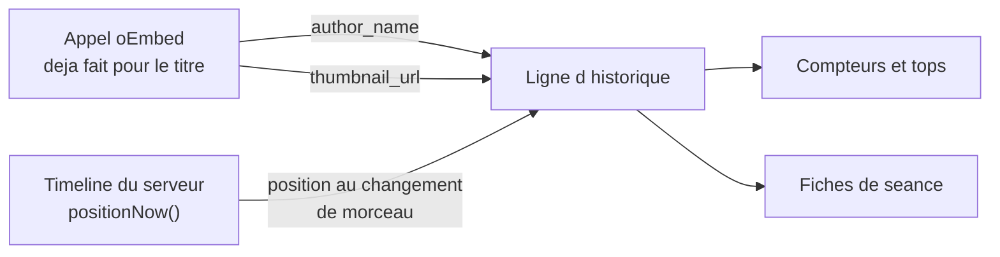

# Memoire des ecoutes - Plan

## Goal Capsule

**Objectif.** Après une soirée d'écoute, un participant connecté peut voir ce qui a été joué, combien de temps, et sous quelle chaîne — et cette vue devient plus riche à chaque soirée sans nouveau développement.

**Means.** Enregistrer d'abord ce que le serveur sait déjà et jette aujourd'hui, montrer ensuite. L'ordre n'est pas un confort : une soirée non enregistrée est perdue définitivement, alors qu'un écran se dessine aussi bien plus tard, et mieux, contre de vraies données.

**Product authority.** Ce plan porte un seul chantier, « voir ce qu'on a écouté ». La recommandation est un chantier voisin, hors périmètre actif.

**Open blockers.** Aucun. Le découpage peut commencer.

---

## Product Contract

### Summary

Le serveur retient désormais, pour chaque morceau joué, sa durée réellement écoutée, son artiste et sa miniature — trois informations qu'il a déjà en main et qu'il jette. Un écran du profil montre ensuite les compteurs, les tops et le détail de chaque soirée, en restant honnête quand les données sont rares.

### Problem Frame

L'application ne garde aujourd'hui qu'une ligne par morceau joué : identifiant, titre, horodatage, et la clé de la séance. Rien sur la durée, rien sur l'artiste. L'unique surface est une liste anti-chronologique plate, sans aucun agrégat.

Le coût n'est pas celui d'une fonctionnalité manquante, c'est celui d'une information qui disparaît. Chaque soirée écoutée sans enregistrement est une soirée dont on ne saura jamais rien, et la base compte aujourd'hui trois lignes. Le besoin n'a pas d'antécédent observable : interrogé, Léopold a répondu qu'il ne cherche pas actuellement à revoir ses écoutes. C'est donc une envie, pas une douleur constatée — ce qui déplace la valeur vers le plaisir de la découverte plutôt que vers l'utilité, et rend la richesse des données décisive.

### Key Decisions

- **Enregistrer avant d'afficher.** *(session-settled: user-directed — chosen over livrer l'écran d'abord : seul l'enregistrement perd de la valeur à attendre.)* Governs R1, R2, R3.
- **L'artiste est le nom de la chaîne YouTube.** *(session-settled: user-approved — chosen over une vraie source d'artiste : gratuit et déjà récupéré, au prix d'une approximation assumée.)* Governs R2.
- **La séance est l'unité de regroupement.** La clé déjà stockée porte l'identifiant d'instance de room, partagé par les deux participants. Governs R8.
- **L'écran assume les petits nombres.** Il doit dire quelque chose de vrai à trois morceaux, pas attendre d'en avoir trois cents. Governs R9.
- **La durée du dernier morceau se rattrape à la destruction de la room.** *(session-settled: user-directed — chosen over accepter la perte, et over une écriture continue pendant la lecture : le nettoyage des rooms vides existe déjà, et il y a exactement un endroit où se brancher.)* Governs R5.
- **Le genre et l'artiste sous-coté sortent du périmètre.** *(session-settled: user-directed — chosen over ajouter une source de métadonnées musicales : ni oEmbed ni l'API YouTube ne donnent de genre, et « sous-coté » n'a pas encore de définition.)*

### Actors

- A1. **L'auditeur connecté.** Écoute, et consulte sa mémoire. Seul acteur dont les écoutes laissent une trace.
- A2. **L'autre participant.** Écoute avec A1. Son compte n'est pas nécessaire pour que la vue de A1 soit complète : la séance se reconstitue depuis les lignes de A1 seul.

### Requirements

**Ce qu'on garde**

- R1. Chaque morceau joué retient la durée pendant laquelle il a effectivement été écouté, pauses exclues et interruptions exclues.
- R2. Chaque morceau joué retient le nom de la chaîne qui l'a publié, quand la source le fournit.
- R3. Chaque morceau joué retient l'adresse de sa miniature, quand la source la fournit.
- R4. Un morceau dont l'artiste ou la miniature n'a pas pu être récupéré reste enregistré, sans eux.
- R5. La durée du morceau en cours est écrite quand la room est détruite, pour qu'une soirée abandonnée en pleine lecture ne perde pas son dernier morceau.

**Ce qu'on montre**

- R6. L'écran affiche des compteurs cumulés : temps écouté, nombre de morceaux, nombre de séances.
- R7. L'écran affiche les morceaux et les artistes les plus écoutés.
- R8. L'écran affiche les séances, de la plus récente à la plus ancienne, chacune avec sa date, ses morceaux et sa durée.
- R9. L'écran reste lisible et non trompeur à faible volume : il ne présente jamais un classement construit sur trop peu de données comme s'il en portait beaucoup.
- R10. L'écran est accessible depuis le profil, et suit la charte « Console » (`docs/design/charte.md`).

### Où chaque donnée existe déjà

Aucune de ces trois informations ne demande un appel réseau supplémentaire : `server/videoTitle.ts` reçoit déjà l'artiste et la miniature et ne garde que le titre, et `server/room.ts` calcule déjà la position, qui gèle en pause et repart à zéro à chaque morceau.

### Key Flows

- F1. Une soirée s'enregistre
  - **Trigger :** un départ commun démarre un morceau dans une room.
  - **Actors :** A1, A2
  - **Steps :** le morceau est inscrit avec son artiste et sa miniature ; quand il cesse d'être le morceau courant, sa durée écoutée est ajoutée à la ligne.
  - **Covered by :** R1, R2, R3, R4, R5

- F2. Consulter sa mémoire
  - **Trigger :** A1 ouvre l'écran depuis son profil.
  - **Actors :** A1
  - **Steps :** les compteurs et les tops s'affichent, puis la liste des séances de la plus récente à la plus ancienne.
  - **Covered by :** R6, R7, R8, R9, R10

### Acceptance Examples

- AE1. **Covers R1.** Un morceau lancé, mis en pause dix minutes, puis repris et zappé après trente secondes de lecture réelle, compte trente secondes.
- AE2. **Covers R1.** Un morceau zappé au bout de dix secondes compte dix secondes, pas sa durée entière.
- AE3. **Covers R4.** Une vidéo dont oEmbed ne répond pas est quand même enregistrée, avec son identifiant, sans artiste ni miniature.
- AE4. **Covers R9.** Avec trois morceaux écoutés au total, l'écran affiche les trois et n'annonce pas de « top » ni de classement.
- AE5. **Covers R5.** Les deux participants quittent pendant la lecture du huitième morceau : ce morceau garde la durée écoutée jusqu'à leur départ, il n'est pas enregistré sans durée.
- AE6. **Covers R8.** Deux morceaux joués dans la même room apparaissent dans une seule séance ; deux morceaux joués dans deux rooms distinctes apparaissent dans deux séances.

### Success Criteria

- Après deux soirées d'écoute réelles, l'écran affiche des chiffres exacts, et Léopold ne les trouve ni vides ni embarrassants.
- Le temps affiché correspond à ce qui a été entendu, à quelques secondes près, et non à la durée des vidéos lancées.

### Scope Boundaries

- **Le genre musical.** Aucune source disponible sans nouvelle dépendance externe.
- **L'artiste le plus sous-coté.** Demande une donnée de popularité et une définition de « sous-coté » qui n'existe pas.
- **La recommandation.** Chantier voisin, à cadrer séparément.
- **Un tableau de bord d'état des rooms.** L'autre sens du mot « dashboard » ; hors sujet ici.
- **Le mobile.** La V1 vise deux ordinateurs (`docs/a-faire.md`).

### Dependencies / Assumptions

- **Un invité ne laisse aucune trace** (R10 du plan comptes, `docs/plans/2026-08-21-0102-feat-comptes-utilisateurs-plan.md`). L'enregistrement ne se remplit donc que si l'utilisateur est connecté pendant l'écoute — ce qui n'a presque jamais été le cas jusqu'ici.
- **Les durées dépendent du correctif du drapeau de lecture** livré en `cce566b`. Avant lui, la timeline gelait après une stagnation et les durées auraient été fausses sans que rien ne le signale.
- **L'artiste est approximatif.** Le nom de chaîne rend « LuisFonsiVEVO » et non « Luis Fonsi », et une compilation porte le nom de qui l'a postée.
- Les migrations s'ajoutent en fin de tableau ordonné, jamais en modifiant une migration livrée (`server/db.ts`).

### Outstanding Questions

**Deferred to Planning**

- Les lignes d'historique déjà écrites n'ont ni durée ni artiste. Les laisser telles quelles ou tenter un rattrapage.
- L'écran est-il une nouvelle page ou une section de l'écran historique existant.

<!-- ce-section: work-relationships -->
### How This Work Fits Together

Ce plan porte **« voir ce qu'on a écouté »**. Le découpage ci-dessous est la compréhension actuelle, pas une feuille de route engagée.

- **Recommandation** — *Depends on* ce plan : elle a besoin d'un historique nourri, et la base compte aujourd'hui trois lignes. *Still to decide :* sur quelle donnée elle s'appuierait, l'API YouTube ne donnant ni genre ni vidéos liées.
- **Bilan poussé en fin de soirée** — *Shares* les données de ce plan, mais change le moment : le bilan se présente quand l'écoute s'arrête au lieu d'être consulté. *Can proceed independently of* l'écran de profil.
- **Tableau de bord d'état des rooms** — *Can proceed independently of* ce plan ; il ne lit pas l'historique mais la mémoire du process.

### Sources / Research

- `server/videoTitle.ts:20` — l'appel oEmbed ne garde que `title` ; `author_name` et `thumbnail_url` arrivent dans la même réponse et sont jetés.
- `server/db.ts:45` — colonnes actuelles de `history_entries` ; `server/db.ts:158` — mécanisme de migration par `PRAGMA user_version`.
- `server/history.ts:40` — construction de la clé `<instanceId>#<itemId>`, partagée par les deux participants.
- `server/room.ts:61` — `positionAt` gèle en pause ; `server/room.ts:262` — la timeline repart à zéro au changement de morceau.
- `client/components/History.tsx` — la seule surface d'historique existante, une liste plate paginée par curseur.
- `docs/design/charte.md` — règles visuelles qu'un nouvel écran doit suivre.
