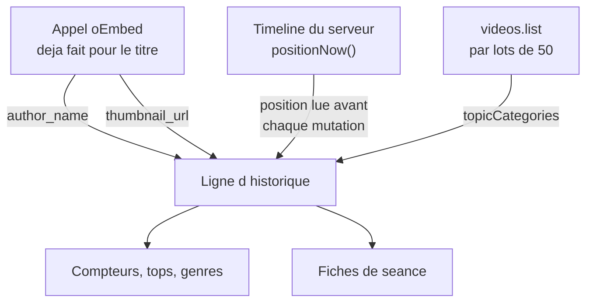
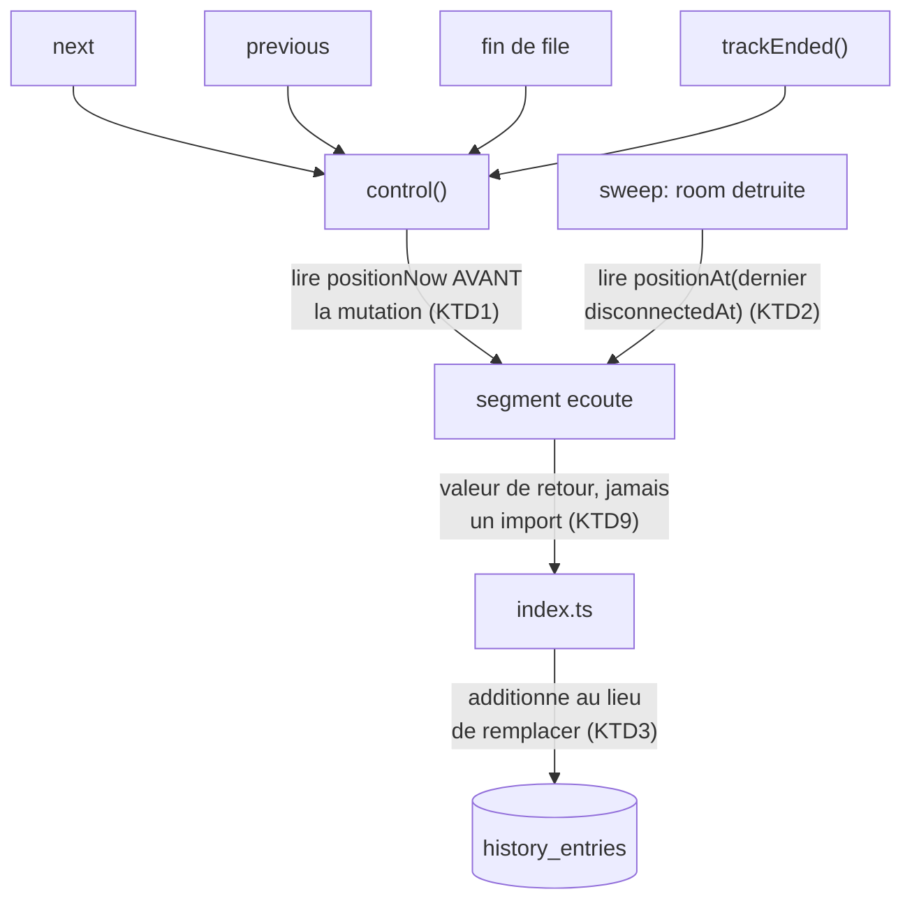
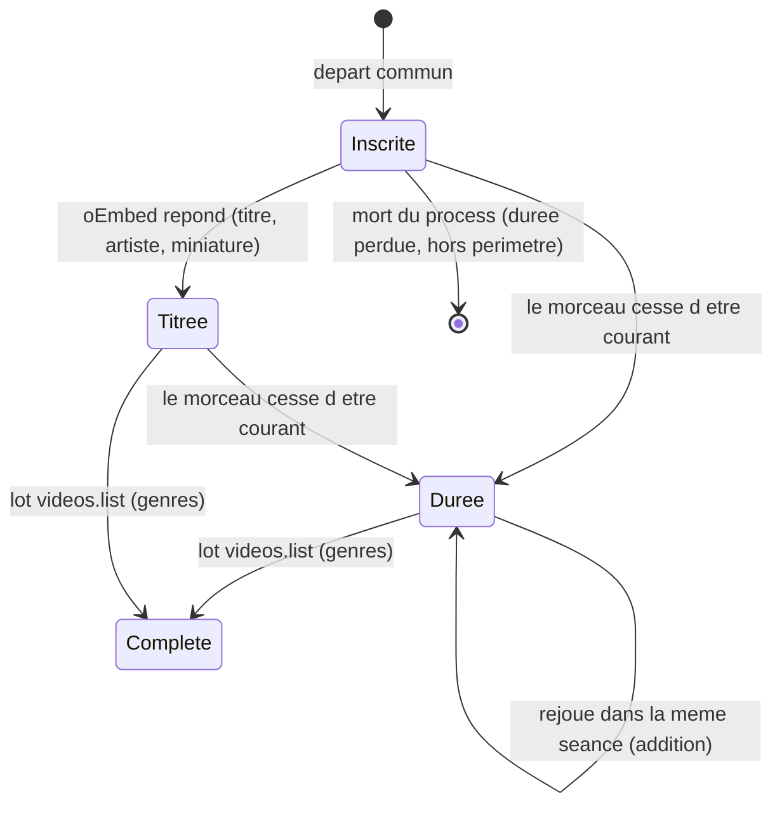
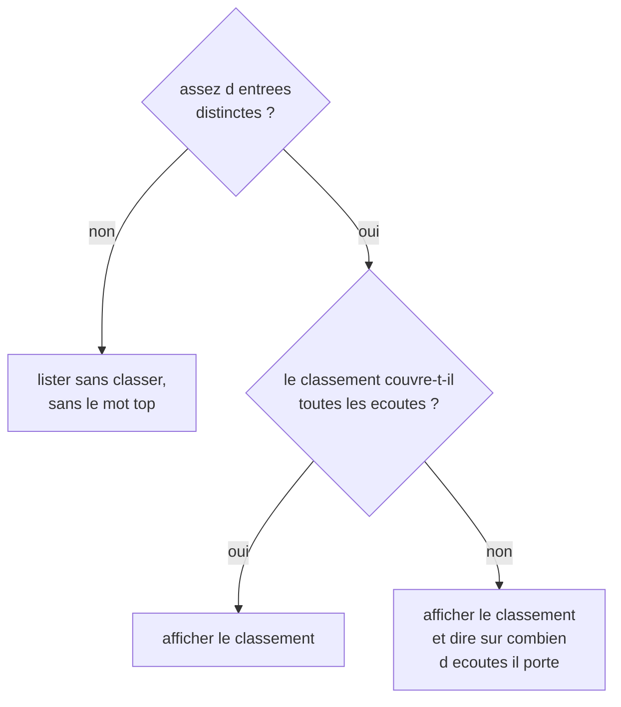

# Memoire des ecoutes - Plan

## Goal Capsule

**Objectif.** Après une soirée d'écoute, un participant connecté peut voir ce qui a été joué, combien de temps, sous quelle chaîne et dans quel genre — et cette vue devient plus riche à chaque soirée sans nouveau développement.

**Means.** Enregistrer d'abord ce que le serveur sait déjà et jette aujourd'hui, montrer ensuite (KTD1, KTD5). L'ordre n'est pas un confort : une soirée non enregistrée est perdue définitivement, alors qu'un écran se dessine aussi bien plus tard, et mieux, contre de vraies données.

**Product authority.** Ce plan porte un seul chantier, « voir ce qu'on a écouté ». La recommandation est un chantier voisin, hors périmètre actif.

**Stop conditions.** S'arrêter et demander si l'implémentation révèle qu'une durée juste exige de mémoriser une position par participant, ou si `videos.list` cesse de rendre `topicDetails`. Les deux invalideraient une décision prise en séance.

**Open blockers.** Aucun.

---

## Product Contract

**Product Contract preservation.** Changé : R14 écarte de l'historique une vidéo que YouTube refuse de décrire ; R9 gagne une règle positive, une surface sans ligne n'étant pas rendue plutôt que rendue à zéro ; R13 nomme ce que le compte apporte, l'accueil affirmant aujourd'hui le contraire ; R1 précise ce que la durée mesure et comment elle s'accumule ; R9 s'étend à la couverture d'un classement ; R11 et R12 ajoutent le genre, entré en périmètre en séance ; la perte du morceau en cours à la mort du process passe en frontière de périmètre. Le reste est inchangé, IDs compris.

### Summary

Le serveur retient désormais, pour chaque morceau joué, sa durée réellement écoutée, son artiste, sa miniature et son genre — quatre informations qu'il a déjà en main ou qu'il peut obtenir sans coût sensible. Un écran du profil montre ensuite les compteurs, les tops et le détail de chaque soirée, en restant honnête quand les données sont rares.

### Problem Frame

L'application ne garde aujourd'hui qu'une ligne par morceau joué : identifiant, titre, horodatage, et la clé de la séance. Rien sur la durée, rien sur l'artiste. L'unique surface est une liste anti-chronologique plate, sans aucun agrégat.

Le coût n'est pas celui d'une fonctionnalité manquante, c'est celui d'une information qui disparaît. Chaque soirée écoutée sans enregistrement est une soirée dont on ne saura jamais rien, et la base compte aujourd'hui trois lignes. Le besoin n'a pas d'antécédent observable : interrogé, Léopold a répondu qu'il ne cherche pas actuellement à revoir ses écoutes. C'est donc une envie, pas une douleur constatée — ce qui déplace la valeur vers le plaisir de la découverte plutôt que vers l'utilité, et rend la richesse des données décisive.

### Key Decisions

- **Enregistrer avant d'afficher.** *(session-settled: user-directed — chosen over livrer l'écran d'abord : seul l'enregistrement perd de la valeur à attendre.)* Governs R1, R2, R3.
- **L'artiste est le nom de la chaîne YouTube.** *(session-settled: user-approved — chosen over une vraie source d'artiste : gratuit et déjà récupéré, au prix d'une approximation assumée.)* Governs R2.
- **La durée mesure ce qui a été joué dans la room, pas ce que chaque personne a entendu.** *(session-settled: user-directed — chosen over borner la durée au passage de chaque participant : demanderait de mémoriser une position par personne et un chemin d'écriture au départ, pour un gain invisible à deux.)* Governs R1.
- **La séance est l'unité de regroupement.** La clé déjà stockée porte l'identifiant d'instance de room, partagé par les deux participants. Governs R8.
- **L'écran assume les petits nombres.** Il doit dire quelque chose de vrai à trois morceaux, pas attendre d'en avoir trois cents. Governs R9.
- **La durée du dernier morceau se rattrape à la destruction de la room.** *(session-settled: user-directed — chosen over accepter la perte, et over une écriture continue pendant la lecture : le nettoyage des rooms vides existe déjà, et il y a exactement un endroit où se brancher.)* Governs R5.
- **Le genre est celui qu'indique YouTube.** *(session-settled: user-directed — chosen over Deezer, mesuré plus juste mais servi par une API dont le portail développeur est fermé, et over MusicBrainz, mesuré peu fiable sur les morceaux connus.)* Governs R11, R12.
- **L'artiste sous-coté sort du périmètre.** *(session-settled: user-directed — chosen over ajouter une source de popularité : « sous-coté » n'a pas encore de définition.)*

### Actors

- A1. **L'auditeur connecté.** Écoute, et consulte sa mémoire. Seul acteur dont les écoutes laissent une trace.
- A2. **L'autre participant.** Écoute avec A1. Son compte n'est pas nécessaire pour que la vue de A1 soit complète : la séance se reconstitue depuis les lignes de A1 seul.

### Requirements

**Ce qu'on garde**

- R1. Chaque morceau joué retient la durée pendant laquelle il a été joué dans la room, pauses exclues et interruptions exclues. La durée s'additionne quand le même morceau redevient courant dans la même séance, et ne décroît jamais.
- R2. Chaque morceau joué retient le nom de la chaîne qui l'a publié, quand la source le fournit, quel que soit le chemin par lequel il est entré dans la file.
- R3. Chaque morceau joué retient l'adresse de sa miniature, quand la source la fournit.
- R4. Un morceau dont l'artiste, la miniature ou le genre n'a pas pu être récupéré reste enregistré, sans eux.
- R5. La durée du morceau en cours est écrite quand la room est détruite, à la position atteinte au départ du dernier participant, pour qu'une soirée abandonnée en pleine lecture ne perde pas son dernier morceau.
- R11. Chaque morceau joué retient les genres que YouTube lui attribue, quand il lui en attribue.
- R14. Un morceau que YouTube refuse de décrire, parce que la vidéo est privée, supprimée ou inexistante, n'entre pas dans l'historique. Un refus de YouTube se distingue d'une panne réseau ou d'un délai dépassé, qui eux laissent le morceau s'enregistrer sans artiste (R4).

**Ce qu'on montre**

- R6. L'écran affiche des compteurs cumulés : temps écouté, nombre de morceaux, nombre de séances.
- R7. L'écran affiche les morceaux et les artistes les plus écoutés.
- R12. L'écran affiche les genres les plus écoutés, au pluriel, en disant qu'un morceau peut compter dans plusieurs.
- R8. L'écran affiche les séances, de la plus récente à la plus ancienne, chacune avec sa date, son heure de début, ses morceaux et sa durée.
- R9. L'écran reste lisible et non trompeur à faible volume : il ne présente jamais un classement construit sur trop peu de données comme s'il en portait beaucoup, et un classement qui ne couvre pas toutes les écoutes dit sur combien il est construit. Une surface qui ne porte sur aucune ligne n'est pas affichée du tout, plutôt que montrée à zéro ; l'écran dit alors en une ligne que la mesure commence maintenant.
- R10. L'écran est accessible depuis le profil, et suit la charte « Console » (`docs/design/charte.md`).
- R13. L'accueil dit ce que le compte apporte : garder ses écoutes et pouvoir les revoir. Le compte reste facultatif, mais l'accueil cesse d'affirmer qu'il ne change rien.

### Où chaque donnée existe déjà

Ni l'artiste ni la miniature ne demandent un appel réseau supplémentaire : `server/videoTitle.ts` reçoit déjà les deux et ne garde que le titre. La durée non plus : `server/room.ts` calcule déjà la position, qui gèle en pause et repart à zéro à chaque morceau. Le genre est la seule donnée qui coûte un appel, et il se remplit par lots après coup (KTD5).

### Key Flows

- F1. Une soirée s'enregistre
  - **Trigger :** un départ commun démarre un morceau dans une room.
  - **Actors :** A1, A2
  - **Steps :** le morceau est inscrit avec son artiste et sa miniature ; quand il cesse d'être le morceau courant, la durée jouée depuis son dernier départ est ajoutée à la ligne.
  - **Covered by :** R1, R2, R3, R4, R5

- F2. Le genre se remplit
  - **Trigger :** l'écran de mémoire est ouvert et des lignes n'ont pas encore de genre.
  - **Actors :** A1
  - **Steps :** les identifiants sans genre sont demandés à YouTube par lots, et les genres rendus sont écrits sur les lignes correspondantes.
  - **Covered by :** R11, R4

- F3. Consulter sa mémoire
  - **Trigger :** A1 ouvre l'écran depuis son profil.
  - **Actors :** A1
  - **Steps :** les compteurs, les tops et les genres s'affichent, puis la liste des séances de la plus récente à la plus ancienne.
  - **Covered by :** R6, R7, R8, R9, R10, R12

### Acceptance Examples

- AE1. **Covers R1.** Un morceau lancé, mis en pause dix minutes, puis repris et zappé après trente secondes de lecture réelle, compte trente secondes.
- AE2. **Covers R1.** Un morceau zappé au bout de dix secondes compte dix secondes, pas sa durée entière.
- AE3. **Covers R4.** Une vidéo dont oEmbed ne répond pas est quand même enregistrée, avec son identifiant, sans artiste ni miniature.
- AE4. **Covers R9.** Avec trois morceaux écoutés au total, l'écran affiche les trois et n'annonce pas de « top » ni de classement.
- AE5. **Covers R5.** Les deux participants quittent pendant la lecture du huitième morceau : ce morceau garde la durée écoutée jusqu'à leur départ, pas celle atteinte au moment où la room est balayée quarante secondes plus tard.
- AE6. **Covers R8.** Deux morceaux joués dans la même room apparaissent dans une seule séance ; deux morceaux joués dans deux rooms distinctes apparaissent dans deux séances.
- AE7. **Covers R1.** Un morceau écouté trente secondes, puis rappelé par « précédent » et réécouté vingt secondes dans la même séance, compte cinquante secondes, pas vingt.
- AE8. **Covers R11, R4.** Une vidéo à laquelle YouTube n'attribue aucun genre reste enregistrée, sans genre, et ne compte dans aucun classement de genre.
- AE9. **Covers R9.** Vingt morceaux écoutés dont douze sans artiste : le top artistes dit qu'il porte sur huit écoutes, pas sur vingt.
- AE10. **Covers R9.** Au jour de la mise en ligne, avec trois lignes sans durée ni artiste : l'écran affiche trois morceaux et trois séances, n'affiche ni compteur de temps ni classement d'artistes, et dit en une ligne que la mesure des durées commence maintenant.
- AE11. **Covers R14.** Une vidéo supprimée, que YouTube refuse de décrire, n'apparaît pas dans l'historique. Une vidéo bien vivante dont la récupération a dépassé son délai y apparaît, sans artiste.

### Success Criteria

- Après deux soirées d'écoute réelles, l'écran affiche des chiffres exacts, et Léopold ne les trouve ni vides ni embarrassants.
- Le temps affiché correspond à ce qui a été entendu, à quelques secondes près, et non à la durée des vidéos lancées.
- Le jour de la mise en ligne, avec trois lignes anciennes sans durée, l'écran n'annonce jamais « 0 minute ».

### Scope Boundaries

**Différé pour plus tard**

- **La perte du morceau en cours à la mort du process.** *(session-settled: user-directed — chosen over un flush sur SIGTERM : la perte est acceptée plutôt qu'écrite en silence.)* Un déploiement Fly, déclenché à chaque merge sur `main`, ou l'arrêt automatique de la machine tuent le process sans passer par le balayage des rooms vides. Les morceaux en cours de toutes les rooms vivantes perdent alors leur durée, exactement comme si R5 n'existait pas.
- **Le traitement visuel des miniatures.** Voir Outstanding Questions.
- **Le rattrapage de l'artiste par l'appel des genres.** L'appel de U6 rend le nom de chaîne dans la même réponse, au même coût, et remplirait les lignes qui n'en ont pas. Écarté pour garder une seule source par champ et une seule graphie par artiste. Conséquence assumée : les trois lignes déjà en base n'auront jamais d'artiste.

**Hors de l'identité du produit**

- **Le rattrapage des durées anciennes.** Les trois lignes déjà en base n'ont pas de durée et n'en auront jamais : elle n'est reconstructible depuis rien. Ce n'est pas un report, c'est une impossibilité. Elles restent groupables et comptables sans durée (KTD4), et R9 impose que les compteurs le disent.
- **L'artiste le plus sous-coté.** Demande une donnée de popularité et une définition de « sous-coté » qui n'existe pas.
- **La recommandation.** Chantier voisin, à cadrer séparément.
- **Un tableau de bord d'état des rooms.** L'autre sens du mot « dashboard » ; hors sujet ici.
- **Le mobile.** La V1 vise deux ordinateurs (`docs/a-faire.md`). Le re-skin ayant été vérifié à 375 px, l'écran ne doit pas régresser, sans être conçu pour.

### Dependencies / Assumptions

- **Un invité ne laisse aucune trace** (R10 du plan comptes, `docs/plans/2026-08-21-0102-feat-comptes-utilisateurs-plan.md`). L'enregistrement ne se remplit donc que si l'utilisateur est connecté pendant l'écoute — ce qui n'a presque jamais été le cas jusqu'ici.
- **Les durées dépendent du correctif du drapeau de lecture** livré en `cce566b`. Avant lui, la timeline gelait après une stagnation et les durées auraient été fausses sans que rien ne le signale.
- **L'artiste est approximatif.** Le nom de chaîne rend « LuisFonsiVEVO » et non « Luis Fonsi », et une compilation porte le nom de qui l'a postée.
- **Le genre est grossier et pluriel.** Mesuré sur trente clips musicaux : 90 % portent au moins un genre, le vocabulaire tient en huit étiquettes, et « Hip hop music » plus « Pop music » pèsent 40 des 55 occurrences. Un morceau porte de un à six genres. L'échantillon vient d'une recherche « clip officiel » et penche vers le rap francophone : le taux de couverture tient, la répartition non.
- **Le genre consomme le quota YouTube.** `videos.list` coûte 1 unité pour 50 identifiants, contre 100 par recherche, sur un budget quotidien de 10 000 (`server/youtubeSearch.ts`). L'enregistrement de l'artiste, lui, reste sans clef (KTD6) et survit à un quota épuisé.
- **La charte est appliquée**, contrairement à ce qu'annonce sa section « État d'application » : le re-skin est livré (`712c080`) et `client/styles.css` porte les tokens Console et les deux faces. Un nouvel écran en hérite sans rien mettre en place. La section périmée mérite un commit `docs:` séparé.
- Les migrations s'ajoutent en fin de tableau ordonné, jamais en modifiant une migration livrée (`server/db.ts`).

### Outstanding Questions

**Différé, ne bloque pas l'implémentation**

- **Le traitement visuel des miniatures.** La charte ne dit rien des images, et `client/styles.css` n'a aucune règle `img`. Une miniature YouTube arrive avec ses propres coins et ses propres couleurs. La charte pose que ce genre d'ajout se discute plutôt qu'il ne se glisse : à trancher avant que l'écran affiche des miniatures, pas avant que la base les stocke. Repli en attendant : l'écran n'en affiche pas.
- **Ce qu'une vidéo indisponible fait à la soirée.** Le gestionnaire d'erreur du lecteur affiche un message et ne fait rien d'autre : il ne passe pas au morceau suivant et ne prévient pas le serveur. La soirée resterait donc plantée sur ce morceau, et on ne sait pas si un départ commun a seulement lieu. Rien de tout cela n'a été reproduit. À observer une fois avant d'en faire un chantier, et sans lien avec R14, qui porte sur l'enregistrement et non sur la lecture.
- **Les accents dans le texte affiché.** La charte demande les accents sur le texte visible ; l'écran d'historique existant écrit « Ce que tu as ecoute en room ». Le nouvel écran suit la charte, ce qui le rend incohérent avec l'ancien jusqu'à ce que quelqu'un tranche.

<!-- ce-section: work-relationships -->
### How This Work Fits Together

Ce plan porte **« voir ce qu'on a écouté »**. Le découpage ci-dessous est la compréhension actuelle, pas une feuille de route engagée.

- **Recommandation** — *Depends on* ce plan : elle a besoin d'un historique nourri, et la base compte aujourd'hui trois lignes. Le genre, qui n'existait pas quand ce lien a été écrit, lui donne une première prise.
- **Bilan poussé en fin de soirée** — *Shares* les données de ce plan, mais change le moment : le bilan se présente quand l'écoute s'arrête au lieu d'être consulté. *Can proceed independently of* l'écran de profil.
- **Écriture des durées à l'arrêt du process** — *Depends on* ce plan, qui écrit la même donnée depuis le balayage des rooms. Le chemin est différé ici, pas exclu.
- **Tableau de bord d'état des rooms** — *Can proceed independently of* ce plan ; il ne lit pas l'historique mais la mémoire du process.

### Sources / Research

- `server/videoTitle.ts:20` — l'appel oEmbed ne garde que `title` ; `author_name` et `thumbnail_url` arrivent dans la même réponse et sont jetés. Aucun cache : un appel par ajout, en fire-and-forget depuis `server/index.ts:545`.
- `server/db.ts:45` — colonnes actuelles de `history_entries` ; `server/db.ts:158` — mécanisme de migration par `PRAGMA user_version`, chaque script dans sa transaction. Une seule migration livrée à ce jour.
- `server/db.test.ts:58` — assertion `user_version === 1`, qui cassera à la deuxième migration.
- `server/history.ts:40` — construction de la clé `<instanceId>#<itemId>` ; `server/history.ts:32` — la garde qui fait qu'un invité ne laisse aucune trace.
- `server/room.ts:239` — `control` est l'entonnoir unique de `next`, `previous`, la fin de file et `trackEnded` ; `next` et `previous` posent `timeline = null`, donc la position retombe à zéro dès la mutation.
- `server/room.ts:313` — `stall()` pose `playing = false` sans réancrer la timeline, contrairement à `control("pause")`. Mesuré : position vraie 29 000 ms, `positionNow` rend 19 500 ms pendant la stagnation.
- `server/roomRegistry.ts:59` — `sweep` rend les codes des rooms détruites, pas les rooms ; `server/index.ts:661` — l'appelant jette même les codes.
- `server/room.ts:142` — `disconnectedAt` par participant, la seule ancre disponible pour la position au départ. Mesuré : départ à 20 000 ms, `positionNow` au balayage rend 60 000 ms.
- `server/index.ts:568` — `send_playlist` passe par `queueAddAll` et n'appelle jamais oEmbed ; `playlist_items` (`server/db.ts:66`) ne porte que `video_id` et `title`.
- `shared/protocol.ts:141` — `QueueItem` est `.strict()` : un champ nouveau doit y être déclaré pour traverser le protocole.
- `client/App.tsx:70` — le routage est une suite de `if` sur `useLocation().pathname`, sans `<Routes>` ; `client/components/AccountBar.tsx:30` — les liens de navigation, affichés sur l'accueil seulement.
- `client/lib/history.ts:7` — le DTO HTTP est redéclaré et revalidé à la main côté client ; aucun type HTTP n'est partagé dans `shared/`.
- `docs/solutions/workflow-issues/serveur-dev-tsx-sans-watch-code-perime.md` — le serveur de dev ne surveille pas les fichiers : tout changement sous `server/` exige un redémarrage manuel.
- `docs/design/charte.md` — règles visuelles qu'un nouvel écran doit suivre ; sa section « État d'application » est périmée.
- Mesure du 09/09/2026, `videos.list` sur trente clips musicaux : 90 % portent un genre, vocabulaire de huit étiquettes, un à six genres par morceau.

---

## Planning Contract

### Key Technical Decisions

- KTD1. **La durée se lit avant la mutation, dans l'entonnoir `control`.** `next` et `previous` posent `timeline = null` et la position retombe à zéro : lire après, c'est enregistrer zéro. `control` couvre `next`, `previous`, la fin de file et `trackEnded`, qui y délègue. C'est le seul point à instrumenter pour les quatre.
- KTD2. **À la destruction de la room, la position se lit à l'instant du dernier départ, pas maintenant.** La timeline continue de courir pendant le délai de grâce puis jusqu'au balayage suivant, soit jusqu'à quarante secondes de silence comptées comme de l'écoute. L'ancre est un instant de dernier départ que la room tient elle-même, posé aussi bien par la déconnexion que par le départ volontaire. Elle ne peut pas se dériver des marques de déconnexion des participants : le départ volontaire supprime l'entrée de présence et n'en laisse aucune, et dans le cas mixte la marque la plus récente serait celle du mauvais participant. Governs R5, AE5.
- KTD3. **La durée s'additionne, elle ne remplace jamais.** Un morceau peut redevenir courant dans la même séance, et il porte alors la même clé persistée. Un `UPDATE` naïf écraserait une durée juste par la durée de la seconde écoute, voire par zéro. Governs R1, AE7.
- KTD4. **L'instance de room devient une colonne, remplie depuis les clés existantes.** La séance n'existe aujourd'hui que comme préfixe d'une chaîne. Grouper par découpage de chaîne n'est pas indexable et duplique le format de clé dans chaque lecture. La migration remplit la colonne pour les lignes déjà là, qui deviennent groupables sans code de compatibilité. Governs R8.
- KTD5. **Le genre se remplit par lots sur les lignes déjà enregistrées, pas au moment d'ajouter un morceau.** *(session-settled: user-directed — chosen over Deezer et MusicBrainz : voir la Key Decision qui gouverne R11 et R12.)* Le chemin de la room reste intact, un appel couvre cinquante morceaux, et l'existant se rattrape par construction. Un genre n'est pas périssable, contrairement à une durée.
- KTD6. **oEmbed reste la source de l'artiste, y compris sur l'envoi d'une playlist.** *(session-settled: user-directed — chosen over stocker l'auteur dans les playlists : ferme le trou sans toucher au schéma des playlists ni aux playlists déjà enregistrées.)* oEmbed n'a ni clef ni quota, donc l'artiste survit à un quota YouTube épuisé, contrairement au genre. Governs R2.
- KTD7. **La miniature se stocke, bien qu'elle se déduise de l'identifiant.** `thumbnail_url` vaut toujours `i.ytimg.com/vi/<videoId>/hqdefault.jpg`. La stocker coûte une colonne et protège d'un changement de forme d'URL chez YouTube, qui laisserait sinon les lignes anciennes sans image. Governs R3.
- KTD8. **La route de lecture des statistiques est nouvelle et porte des agrégats.** La route d'historique existante pagine des lignes par curseur et couperait une séance en deux. Son DTO est redéclaré à la main côté client, comme pour le compte et les playlists ; la nouvelle route suit cette convention plutôt que d'inaugurer un type HTTP partagé. Governs R6, R7, R8, R12.
- KTD9. **`room.ts` ne persiste rien.** La room ignore que la persistance existe (KD3 du plan comptes) et n'importe que `shared/`. La durée remonte par valeur de retour vers l'appelant, qui écrit. Aucun import de `history.ts` depuis `room.ts`.
- KTD10. **Les tops classent par temps cumulé, avec un départage stable.** Le compteur phare de R6 est le temps ; classer par nombre de lectures raconterait autre chose que ce que l'écran met en avant. À égalité, l'ordre suit l'identifiant décroissant, comme l'index d'historique existant, pour qu'un classement ne se réordonne pas entre deux chargements. Le classement des genres n'a pas d'identifiant à départager, ses entrées étant des étiquettes de texte : il se départage par ordre alphabétique de l'étiquette, seule clé déterministe que ces lignes portent.
- KTD11. **`stall()` gèle la position comme `control("pause")` le fait.** Il pose `playing = false` sans réancrer, donc `positionAt` retombe sur le dernier départ commun. La position rapportée par le client, déjà passée à la barrière, est l'ancre. Sans ce correctif, une fin de morceau tombant pendant une publicité enregistre une durée massivement fausse, en silence. Governs R1.
- KTD12. **La colonne des genres porte un tableau JSON de chaînes.** Un morceau porte de un à six genres, donc la colonne tient une liste. Le format JSON permet à SQLite de la parcourir nativement, donc U7 compte les morceaux par genre en une requête au lieu de relire les lignes. Il donne aussi gratuitement l'état que U6 réclame : rien du tout signifie « jamais interrogée », un tableau vide signifie « interrogée, aucun genre ». Sans cette distinction, les vidéos sans genre seraient redemandées à chaque ouverture de l'écran. Governs R11, R12.

### High-Level Technical Design

**Où la durée se lit et où elle s'écrit.** Le point commun des quatre chemins de gauche est qu'ils passent tous par `control` ; le cinquième est le seul à vivre hors de la room.

**Cycle de vie d'une ligne d'historique.** Une ligne naît sans durée et sans genre, et se complète par étapes indépendantes. Aucune étape n'est bloquante pour les autres, ce qui est ce qui rend R4 tenable.

**Ce que l'écran a le droit d'affirmer.** R9 se traduit par deux gardes, l'une sur le volume, l'autre sur la couverture.

### Assumptions

- Le seuil au-delà duquel un classement s'appelle un « top » est fixé à cinq entrées distinctes, compté sur les entrées classées et non sur les lignes. Sans ce compte, vingt écoutes de deux morceaux passeraient un seuil exprimé en lignes et produiraient un « top » à deux entrées, ce que R9 interdit en esprit.
- Le nombre de morceaux compte les lignes jouées, pas les vidéos distinctes : la même vidéo ajoutée deux fois dans une file donne deux lignes, et c'est bien deux écoutes.
- Une séance porte la date et l'heure de son premier morceau. L'heure sépare deux séances du même jour, atteignable dès aujourd'hui, et rend lisible une séance à cheval sur minuit.
- Quand plusieurs lignes portent la même vidéo, le titre et la miniature retenus sont les plus récents non nuls.
- Chaque barrière coûte environ 500 ms de position mesurée : trente secondes de lecture réelle rendent 29 500 ms. Un morceau qui stagne six fois perd environ trois secondes, ce qui reste dans le « à quelques secondes près » des Success Criteria. Écrit ici pour que personne ne le rechasse.

### Sequencing

L'enregistrement passe en entier avant l'écran. À l'intérieur de l'enregistrement, le correctif de la stagnation vient avant toute lecture de position au changement de morceau : sans lui les tests de durée passeraient sur un chemin sain tout en étant faux en production.

Le remplissage des genres vit en phase 2 malgré son rôle d'enregistrement, parce qu'il se déclenche depuis la route de statistiques et ne peut donc ni se câbler ni se vérifier avant elle. Ce n'est pas une entorse à l'ordre : un genre se rattrape indéfiniment sur les lignes déjà écrites, une durée non.

### Risques et notes opérationnelles

- **La migration s'exécute seule sur la base de production.** L'intégration continue déploie sur Fly à chaque merge sur `main`, après les portes de vérification. Il n'y a donc ni fenêtre de relecture, ni sauvegarde automatique du fichier de base sur le volume. La migration est additive — des colonnes nullables et le remplissage d'une colonne dérivée depuis une valeur déjà présente — donc le risque n'est pas une perte de forme mais une erreur de script. Filet le moins cher, à faire avant de merger : ouvrir une console sur la machine et copier le fichier de base. Ce n'est pas une étape du code, c'est un geste à poser une fois.
- **L'arrêt automatique de la machine peut battre le balayage.** La configuration Fly arrête la machine quand plus personne n'est connecté, et le balayage n'écrit qu'après le délai de grâce puis jusqu'au balayage suivant. R5 peut donc passer tous les tests en local et ne jamais s'exécuter en production. À observer une fois en conditions réelles, pas à corriger d'avance.
- **Le quota YouTube est partagé.** Le remplissage des genres et la recherche puisent au même budget quotidien. Un remplissage non borné pourrait éteindre la recherche pour la journée. Rien d'existant ne l'en protège : le garde de budget compte des recherches et ne voit pas cet appel. La seule protection est la borne posée par U6, et reprendre le garde de la recherche facturerait cent unités pour un lot qui en coûte une.

---

## Implementation Units

### Phase 1 — Enregistrer

### U1. Correctif du gel de la timeline pendant une stagnation

**Goal.** `stall()` fige la position comme `control("pause")`, pour qu'une durée lue pendant une publicité ou un buffer ne retombe pas sur le dernier départ commun.

**Requirements.** R1, KTD11.

**Dependencies.** Aucune.

**Files.** `server/room.ts`, `server/room.test.ts`

**Approach.**
1. Dans `stall()`, réancrer la timeline sur la position rapportée par le client avant de poser `playing = false`, dans la forme déjà employée par `control("pause")`.
2. Commenter le pourquoi en citant la mesure du 09/09/2026 et le lien de parenté avec le défaut corrigé en `cce566b` : la séparation entre le drapeau de lecture et la timeline a déjà coûté deux jours, et ce module documente cette histoire.

**Execution note.** Écrire le test qui échoue d'abord, et vérifier qu'il échoue bien sans le correctif. La valeur rouge attendue est connue : position vraie 29 000 ms, `positionNow` rend 19 500 ms.

**Patterns to follow.** `control("pause")` dans `server/room.ts` pour la forme du réancrage ; `server/room.test.ts` pour les fixtures `playingRoom()` et `playingAt(startMs)`.

**Test scenarios.**
- Morceau démarré, pause à 20 s, reprise, 10 s de lecture réelle, puis stagnation annoncée : `positionNow` rend environ 29 000 ms pendant la stagnation, pas 19 500 ms.
- Morceau démarré et stagnation annoncée à 20 s sans pause préalable : `positionNow` rend environ 20 000 ms, pas 0.
- La position reste figée pendant toute la stagnation : deux lectures espacées de dix secondes rendent la même valeur.
- La réouverture de la barrière repart de la position rapportée, sans régression sur les tests de synchronisation existants.

**Verification.** Le test rouge devient vert, et la suite de `server/room.test.ts` reste entièrement verte.

### U2. Migration : durée, artiste, miniature, genres, instance de room

**Goal.** `history_entries` porte les colonnes de la mémoire des écoutes, et les lignes déjà en base deviennent groupables par séance.

**Requirements.** R1, R2, R3, R4, R8, R11, KTD4, KTD7, KTD12.

**Dependencies.** Aucune.

**Files.** `server/db.ts`, `server/db.test.ts`

**Approach.**
1. Ajouter une entrée en fin du tableau ordonné `MIGRATIONS` : cinq colonnes nullables sur `history_entries` (durée écoutée, nom de chaîne, adresse de miniature, genres, instance de room), plus le remplissage de l'instance depuis le préfixe des clés déjà stockées. La colonne des genres porte un tableau JSON de chaînes (KTD12) : absente tant que la ligne n'a pas été interrogée, tableau vide une fois interrogée sans résultat.
2. Ne jamais modifier la migration livrée. La nouvelle porte le numéro de version 2.
3. Étendre les instructions préparées qui listent leurs colonnes explicitement, et le mappage vers la forme camelCase.
4. Faire passer les textes venus de YouTube par le garde de longueur existant, comme le titre.
5. Ajouter un index servant le regroupement par séance et par compte.

**Execution note.** Reprendre l'assertion `user_version === 1` de `server/db.test.ts` comme conséquence attendue, pas comme régression. En développement, la base locale ne rejoue pas une migration déjà appliquée : la supprimer pour repartir propre.

**Patterns to follow.** Le commentaire en tête du tableau `MIGRATIONS` dans `server/db.ts` ; `title TEXT` comme précédent de colonne nullable ; le garde de longueur appliqué au titre.

**Test scenarios.**
- Une base neuve arrive en version 2 et porte les cinq nouvelles colonnes sur `history_entries`.
- Une base en version 1 contenant des lignes migre vers 2 sans perte : les lignes gardent identifiant, titre et horodatage.
- Le remplissage de l'instance de room rend, pour une clé de la forme instance suivie du séparateur puis de l'identifiant d'élément, exactement le préfixe.
- Une ligne dont la clé ne contient pas de séparateur ne fait pas échouer la migration.
- Une migration qui échoue laisse la version inchangée et la table intacte, conformément à la transaction par script.
- Les nouvelles colonnes valent `NULL` sur les lignes migrées, et la lecture les rend `null` plutôt que de planter.
- Une colonne de genres portant un tableau JSON se relit comme une liste de chaînes ; un tableau vide se distingue d'une colonne absente.

**Verification.** La suite de `server/db.test.ts` passe, y compris l'assertion de version corrigée, et une base d'avant migration ouvre sans erreur.

### U3. oEmbed rend l'artiste et la miniature, sur tous les chemins d'ajout

**Goal.** L'artiste et la miniature traversent le protocole jusqu'à la ligne d'historique, qu'un morceau soit ajouté un par un ou par envoi d'une playlist.

**Requirements.** R2, R3, R4, R14, KTD6, KTD7.

**Dependencies.** U2.

**Files.** `server/videoTitle.ts`, `server/videoTitle.test.ts`, `server/index.ts`, `server/room.ts`, `server/room.test.ts`, `shared/protocol.ts`, `server/history.ts`, `server/history.test.ts`, `client/lib/*`

**Approach.**
1. Faire rendre à la récupération oEmbed un résultat qui distingue trois cas au lieu d'un seul : la réponse utile, le **refus de YouTube** (statut non conforme, mesuré à 400 sur un identifiant invalide), et la panne — réseau, délai dépassé, réponse illisible. Aujourd'hui les trois donnent la même valeur vide, ce qui empêche R14 d'exister.
1b. Marquer sur l'élément de file le morceau que YouTube a refusé. C'est un état de file, pas de la persistance : la room continue d'ignorer que l'historique existe (KTD9).
2. Déclarer les nouveaux champs sur l'élément de file du protocole partagé, qui est strict et rejette tout champ non déclaré, puis les propager jusqu'au poseur de titre de la room.
3. Appeler la récupération aussi sur l'ajout groupé d'une playlist, en bornant le nombre de requêtes simultanées.
4. Écrire les deux champs sur la ligne au départ commun, et accepter qu'ils manquent quand la réponse arrive après.
5. Ne pas inscrire de ligne pour un morceau marqué refusé (R14). Une panne, elle, n'empêche rien : le morceau reste jouable et s'enregistre sans artiste.

**Execution note.** Le titre voyage déjà par ce chemin en fire-and-forget ; l'artiste hérite du même trou, déjà documenté dans `server/history.ts`. Ne pas inventer un rattrapage ici : U4 en porte un à l'étape 5, au moment où la durée s'écrit, quand la ligne est déjà en écriture.

**Patterns to follow.** Le repli de `server/videoTitle.ts` qui traite l'absence de titre comme un cas normal et non comme une erreur ; le mocking de `fetch` par sauvegarde et restauration manuelle dans `server/videoTitle.test.ts`.

**Test scenarios.**
- Une réponse oEmbed complète rend le titre, le nom de chaîne et l'adresse de miniature.
- Une réponse sans nom de chaîne rend le titre seul, sans lever.
- Une réponse utile rend le titre, le nom de chaîne et l'adresse de miniature.
- Un statut non conforme rend un refus, distinct d'une panne.
- Un délai dépassé, une coupure réseau et une réponse illisible rendent une panne, distincte d'un refus.
- Covers AE11. Un morceau refusé par YouTube n'écrit aucune ligne d'historique.
- Covers AE3. Un morceau dont la récupération est tombée en panne écrit sa ligne, sans artiste ni miniature.
- Un morceau ajouté un par un arrive en base avec son nom de chaîne.
- Un envoi de playlist de plusieurs morceaux déclenche une récupération par morceau, et chaque ligne d'historique porte son nom de chaîne.
- Covers AE3. Une vidéo dont oEmbed ne répond pas est enregistrée avec son identifiant, sans artiste ni miniature.
- Un élément de file portant un champ non déclaré est toujours rejeté par le protocole strict.

**Verification.** Une soirée jouée localement, moitié par ajouts un par un, moitié par envoi de playlist, laisse des lignes portant toutes leur nom de chaîne quand la vidéo en a un.

### U4. Écriture de la durée quand un morceau cesse d'être courant

**Goal.** Les quatre chemins qui passent par l'entonnoir de transport ajoutent à la ligne le temps joué depuis le dernier départ.

**Requirements.** R1, KTD1, KTD3, KTD9.

**Dependencies.** U1, U2, U3.

**Files.** `server/room.ts`, `server/room.test.ts`, `server/history.ts`, `server/history.test.ts`, `server/db.ts`, `server/db.test.ts`, `server/index.ts`

**Approach.**
1. Faire rendre à l'entonnoir de transport le segment écouté du morceau qui vient de cesser d'être courant, lu avant toute mutation de la timeline.
2. Laisser l'appelant écrire, la room ne connaissant pas la persistance.
3. Ajouter au module de persistance un chemin d'accumulation distinct de la déduplication : le départ commun crée la ligne et garde son premier horodatage, la fin de morceau ajoute à la durée existante.
4. Adresser ce chemin par la clé de morceau seule, sans identifiant de compte. Les lignes n'existent que pour des comptes connectés, puisque le départ commun applique déjà la garde ; exiger un compte à l'écriture rendrait le chemin inutilisable à la destruction de la room, où plus aucune session n'existe (voir U5).
5. Compléter au passage le titre, le nom de chaîne et la miniature quand la ligne les porte à vide et que l'élément de file les connaît désormais. C'est le rattrapage d'une réponse oEmbed arrivée après le départ commun, et il ne coûte rien puisque la ligne est déjà en écriture.

**Execution note.** Écrire d'abord le test des deux exemples d'acceptation sur la durée, et vérifier qu'ils échouent sans le code.

**Patterns to follow.** La garde qui fait qu'un invité ne laisse aucune trace, dans `server/history.ts` ; l'idempotence par contrainte d'unicité dans `server/db.ts`, dont l'accumulation doit rester distincte ; les titres de test citant l'exigence, dans `server/history.test.ts`.

**Test scenarios.**
- Covers AE1. Morceau lancé, pause de dix minutes, reprise, puis passage au suivant après trente secondes de lecture réelle : la ligne porte environ trente secondes.
- Covers AE2. Morceau passé au suivant après dix secondes : la ligne porte dix secondes, pas la durée de la vidéo.
- Covers AE7. Morceau écouté trente secondes, rappelé par « précédent », réécouté vingt secondes : la ligne porte cinquante secondes.
- La fin naturelle d'une piste écrit la durée, comme le passage manuel au suivant.
- Le dernier morceau de la file, quand le passage au suivant vide la lecture, écrit sa durée.
- Un participant non connecté ne produit aucune ligne et aucune écriture de durée.
- Deux participants connectés produisent deux lignes portant la même durée.
- Un morceau dont la durée est déjà écrite et qui n'est pas rejoué garde sa valeur : aucune écriture ne la ramène à zéro.
- Une ligne écrite sans nom de chaîne, dont l'élément de file en porte un au moment où la durée s'écrit, ressort avec son nom de chaîne.
- Une ligne portant déjà un titre n'est pas écrasée par une valeur vide arrivée plus tard.
- L'écriture de la durée aboutit sans qu'aucune session ni aucun compte ne soit fourni au module de persistance.
- La room n'importe pas le module de persistance.

**Verification.** Les exemples d'acceptation sur la durée passent, et la suite complète reste verte.

### U5. Point d'accroche à la destruction de la room

**Goal.** Une soirée abandonnée en pleine lecture garde la durée de son dernier morceau, mesurée au départ du dernier participant.

**Requirements.** R5, KTD2, KTD9.

**Dependencies.** U4.

**Files.** `server/roomRegistry.ts`, `server/roomRegistry.test.ts`, `server/index.ts`, `server/room.ts`, `server/room.test.ts`, `server/history.ts`, `server/history.test.ts`

**Approach.**
1. Ouvrir un point d'accroche au balayage : aujourd'hui il rend les codes des rooms détruites, et l'appelant les jette. Il doit rendre la room détruite **et son instance**, le temps d'une lecture — l'instance ne se retrouve plus après coup, l'entrée du registre venant d'être supprimée.
2. Tenir sur la room un instant de dernier départ, posé aussi bien par la déconnexion que par le départ volontaire (KTD2). Ne pas le dériver des marques de déconnexion des participants : le départ volontaire supprime l'entrée de présence sans en laisser.
3. Lire la position à cet instant, non à l'instant du balayage, et écrire par le chemin d'accumulation de U4, qui n'exige aucun compte.
4. Ne rien écrire quand aucun morceau n'était courant. Aucune session n'existe plus à cet instant : la sélection des lignes à compléter se fait par la clé de morceau, et les seules lignes existantes sont celles de comptes connectés.

**Execution note.** L'écart à couvrir est mesuré : départ à 20 000 ms, position au balayage 60 000 ms. Le test doit distinguer les deux valeurs, sinon il passerait avec l'implémentation naïve.

**Patterns to follow.** Les tests de balayage et d'instance de `server/roomRegistry.test.ts`.

**Test scenarios.**
- Covers AE5. Les deux participants se déconnectent pendant un morceau : la ligne porte la position au départ, pas celle atteinte au balayage quarante secondes plus tard.
- Une room détruite alors qu'aucun morceau n'est courant n'écrit rien.
- Une room détruite après un départ volontaire, qui libère la place immédiatement, écrit aussi la durée à la position du départ.
- Cas mixte : l'un perd sa socket, l'autre part volontairement cinquante secondes plus tard. La durée est mesurée au second départ, pas au premier.
- L'écriture aboutit alors qu'aucune session ni aucun compte n'existe plus pour cette room.
- Le point d'accroche rend l'instance de room, et l'écriture vise la bonne séance.
- Une room encore occupée n'est pas balayée et n'écrit rien.
- Le morceau courant qui avait déjà accumulé une durée lors d'une écoute précédente voit le dernier segment s'ajouter, pas la remplacer.
- Les codes rendus par le balayage restent utilisables par les appelants existants.

**Verification.** Une soirée locale, arrêtée en fermant les deux onglets pendant un morceau, laisse ce morceau avec une durée proche du moment de fermeture.

### Phase 2 — Montrer

### U6. Remplissage des genres par lots

**Goal.** Les lignes sans genre reçoivent ceux que YouTube attribue, y compris celles déjà en base.

**Requirements.** R11, R4, KTD5, KTD12.

**Dependencies.** U2.

**Files.** `server/videoTopics.ts` (nouveau), `server/videoTopics.test.ts` (nouveau), `server/db.ts`, `server/db.test.ts`, `server/index.ts`

**Approach.**
1. Créer un module dédié à la récupération des genres, sur le modèle du module de recherche : clef côté serveur uniquement, réponse décrite au strict nécessaire et tolérante aux champs nouveaux.
2. Demander les genres par lots d'au plus cinquante identifiants, borne de l'API. La réponse rend des adresses d'articles encyclopédiques, pas des étiquettes : normaliser en retirant le préfixe d'adresse et en rendant les tirets bas aux espaces, puis écarter l'étiquette générique « Music ».
3. Écrire les genres sur les lignes correspondantes sous forme de tableau JSON (KTD12), en écrivant un tableau vide quand YouTube n'en attribue aucun : c'est ce qui empêche de redemander la même vidéo à chaque ouverture.
4. Exposer un point d'entrée appelable, borné en nombre de lots par appel et sans valeur de retour bloquante. C'est U7, la route de statistiques, qui le câble : elle est la seule surface que l'ouverture de l'écran appelle côté serveur.
5. Traiter un quota épuisé comme un cas distinct d'une panne, comme le fait la recherche : réessayer n'y change rien.

**Execution note.** Ce module appelle un service externe : le mocking de `fetch` suit le précédent du module de titre. La borne de l'étape 4 est la seule protection du quota : le garde de budget existant ne compte que des recherches et ne voit pas cet appel.

**Patterns to follow.** `server/youtubeSearch.ts` en entier, pour la clef qui ne quitte pas le serveur, le schéma tolérant, et la distinction entre quota épuisé et panne. Ne pas reprendre son garde de budget, qui compte des recherches à 100 unités et facturerait cent fois le coût réel d'un lot.

**Test scenarios.**
- Une réponse portant plusieurs catégories rend les genres normalisés, sans l'étiquette générique.
- Covers AE8. Une vidéo sans catégorie est marquée interrogée et reste sans genre, et n'est pas redemandée au passage suivant.
- Un lot de plus de cinquante identifiants est découpé en plusieurs requêtes.
- Une réponse partielle, où certains identifiants manquent, écrit ce qui est revenu et laisse le reste à traiter.
- Un quota épuisé n'écrit rien et se distingue d'une panne réseau.
- Une réponse illisible n'efface aucun genre déjà écrit.
- Une vidéo non musicale rend des étiquettes non musicales sans que le module lève.
- Le nombre de lots par déclenchement est borné, et un historique plus grand que la borne laisse le reste pour le passage suivant.

**Verification.** Le module s'appelle directement sur des lignes de test, sans écran : les lignes sans genre en reçoivent ou sont marquées interrogées, pour une unité de quota par cinquante lignes.

### U7. Route de lecture des statistiques

**Goal.** Une route rend les compteurs, les tops, les genres et les séances, avec les gardes d'honnêteté que l'écran doit respecter.

**Requirements.** R6, R7, R8, R9, R12, KTD8, KTD10.

**Dependencies.** U2, U3, U4, U6.

**Files.** `server/db.ts`, `server/db.test.ts`, `server/index.ts`, `server/index.test.ts`

**Approach.**
1. Ajouter au module de persistance les lectures agrégées, toutes bornées par le compte du demandeur.
2. Le compteur de temps ne somme que les lignes portant une durée, et rend aussi combien de lignes en portent une, pour que l'écran puisse dire sur quoi il porte.
3. Les tops classent par temps cumulé, avec départage stable par identifiant décroissant. Une ligne sans durée en est exclue : la garder la ferait peser zéro seconde tout en gonflant le dénominateur, exactement le problème que l'étape 2 résout pour le compteur de temps.
4. Chaque classement rend le nombre d'écoutes qu'il couvre et le nombre d'entrées distinctes qu'il contient, l'écran décidant ensuite s'il a le droit de dire « top ». La couverture porte sur les seules écoutes réellement classées, donc elle exclut les lignes sans durée comme celles sans artiste.
5. Les genres comptent des morceaux par genre, un morceau pouvant compter dans plusieurs. À nombre égal, l'ordre suit l'étiquette par ordre alphabétique (KTD10).
6. Les séances se groupent par la colonne d'instance, portent la date et l'heure de leur premier morceau, leur nombre de morceaux **et leur durée totale**, somme des durées de leurs lignes. R8 exige les quatre.
7. Les séances se paginent par curseur sur la séance, jamais sur la ligne, pour qu'une séance ne soit jamais coupée en deux.
8. La route refuse un demandeur non connecté comme les routes existantes.
9. Après avoir composé sa réponse, la route déclenche le remplissage des genres de U6, borné et sans bloquer.

**Patterns to follow.** La route d'historique de `server/index.ts` pour la forme du curseur et le refus d'un invité ; les instructions préparées listant leurs colonnes dans `server/db.ts` ; le mappage vers la forme camelCase.

**Test scenarios.**
- Covers AE4. Trois morceaux écoutés au total : la réponse porte trois entrées et un compte d'entrées distinctes inférieur au seuil, permettant à l'écran de ne pas annoncer de top.
- Covers AE9. Vingt écoutes dont douze sans artiste : le classement des artistes rend une couverture de huit écoutes.
- Le compteur de temps ignore les lignes sans durée et rend combien de lignes en portent une.
- Covers AE6. Deux morceaux dans une même instance rendent une séance ; deux morceaux dans deux instances rendent deux séances.
- Une séance de trois morceaux de durées connues porte une durée totale égale à leur somme.
- Une séance dont une ligne n'a pas de durée porte quand même une durée totale, égale à la somme des lignes qui en ont.
- Un historique mêlant lignes avec et sans durée ne fait apparaître les lignes sans durée dans aucun top, et la couverture annoncée ne les compte pas.
- Deux séances le même jour se distinguent par leur heure de début.
- Une séance à cheval sur minuit porte la date de son premier morceau.
- Deux morceaux à égalité de temps cumulé sortent toujours dans le même ordre sur deux appels successifs.
- Deux genres portant le même nombre de morceaux sortent par ordre alphabétique, et dans le même ordre sur deux appels successifs.
- Un morceau joué dans deux séances est agrégé en une entrée du top, portant le titre le plus récent non nul.
- Un morceau portant plusieurs genres compte dans chacun, le comptage se faisant par parcours du tableau JSON en base (KTD12).
- Une ligne jamais interrogée et une ligne interrogée sans genre se distinguent, et ni l'une ni l'autre ne compte dans un classement de genre.
- La pagination des séances ne coupe jamais une séance en deux.
- Un demandeur non connecté est refusé.
- Un compte sans aucune écoute rend des compteurs à zéro et des classements vides, sans erreur.

**Verification.** La route répond sur la base locale avec des chiffres cohérents avec les lignes présentes, et la suite complète reste verte.

### U8. Écran de mémoire des écoutes

**Goal.** Un écran du profil montre les compteurs, les tops, les genres et les fiches de séance, sans jamais affirmer plus que ce que les données portent.

**Requirements.** R6, R7, R8, R9, R10, R12, R13.

**Dependencies.** U7.

**Files.** `client/components/Memoire.tsx` (nouveau), `client/components/Memoire.test.tsx` (nouveau), `client/lib/memoire.ts` (nouveau), `client/App.tsx`, `client/components/AccountBar.tsx`, `client/styles.css`

**Approach.**
1. Ajouter une branche de route dans le composant racine, qui tient l'état et les appels, l'écran restant un composant pur à props.
2. Monter l'écran seulement une fois la réponse d'identité reçue, en distinguant l'attente de l'invité, comme le font les écrans de compte et d'historique.
3. Distinguer une seconde attente, celle des statistiques elles-mêmes, de l'état « aucune écoute ». Sans elle, quelqu'un qui a des séances verrait passer l'invitation à écouter entre l'arrivée de l'identité et celle des chiffres, ce que R9 interdit. L'écran d'historique tient déjà cette distinction.
4. Paginer les séances comme l'écran d'historique pagine ses lignes, avec le même bouton et le même curseur, appliqué aux séances. Sans lui, les séances au-delà de la première page deviennent inatteignables et R8 n'est pas tenue.
5. Bâtir l'écran sur la coquille large et les modules de la charte, l'écran d'historique existant restant sur sa plaque étroite et inchangé.
6. N'afficher aucune miniature tant que leur traitement visuel n'est pas tranché.
7. Écrire les gardes d'honnêteté dans la copie : un classement sous le seuil se présente comme une liste, un classement partiel dit sur combien d'écoutes il porte, un compteur de temps dit combien de morceaux il couvre, et une surface qui ne porte sur aucune ligne n'est pas rendue (R9). Les compteurs calculables restent affichés : au jour un, trois morceaux et trois séances s'affichent, seul le temps disparaît.
8. Ajouter le lien dans la barre de navigation du profil, et y réécrire la phrase adressée à l'invité : le compte reste facultatif, mais il sert à garder et revoir ses écoutes, ce que « Sans compte, tout marche pareil » nie (R13).

**Execution note.** L'écran doit être lisible dès aujourd'hui, avec trois lignes sans durée : c'est l'état de la base, pas un cas limite théorique.

**Patterns to follow.** `client/components/History.tsx` pour la forme du composant pur à props et le traitement de l'invité ; `client/components/AccountScreen.tsx` pour l'appartenance au profil ; `client/lib/history.ts` pour la validation manuelle champ par champ, sans jeter ; le vocabulaire de classes de `docs/design/charte.md` ; `client/components/Transport.tsx` pour les icônes en SVG en ligne.

**Test scenarios.**
- Un invité voit une invitation à se connecter, pas des compteurs vides.
- Tant que la réponse d'identité n'est pas arrivée, l'écran n'est pas monté.
- Un compte sans aucune écoute voit un état vide qui invite à écouter, pas des zéros.
- Entre l'arrivée de l'identité et celle des statistiques, l'écran montre une attente, jamais l'invitation à écouter ni des zéros.
- Les séances au-delà de la première page restent atteignables par le bouton de pagination.
- Une fiche de séance affiche sa durée totale à côté de sa date.
- Covers AE4. Trois morceaux écoutés : les trois s'affichent, et le mot « top » n'apparaît nulle part.
- Un compteur de temps portant sur une partie des lignes dit sur combien de morceaux il porte, et n'affiche jamais « 0 minute » quand des lignes sans durée existent.
- Covers AE10. Trois lignes sans durée ni artiste : le compteur de temps et le classement des artistes ne sont pas rendus, les compteurs de morceaux et de séances affichent trois, et une ligne dit que la mesure commence maintenant.
- Une fiche de séance dont aucune ligne n'a de durée n'affiche pas de durée, et affiche quand même sa date et ses morceaux.
- Un classement partiel affiche le nombre d'écoutes qu'il couvre.
- Une fiche de séance affiche sa date et son heure de début.
- Une séance d'un seul morceau s'affiche sans copie supposant plusieurs morceaux.
- Un morceau sans titre affiche son identifiant, comme la file et l'historique.
- Un morceau sans artiste n'apparaît pas dans le classement des artistes et reste dans celui des morceaux.
- L'écran ne pose aucune couleur hors tokens, et n'utilise ni la couleur d'accent sur plus d'une action, ni la couleur de témoin sur un compteur.
- L'écran rend dans les deux faces, jour et nuit.
- Covers R13. L'invité voit sur l'accueil une phrase qui dit ce que le compte apporte, et non qu'il ne change rien.
- L'écran d'historique existant rend exactement comme avant.

**Verification.** L'écran rend en chaîne dans les tests, et une ouverture manuelle sur la base locale à trois lignes montre quelque chose de vrai et de non embarrassant, dans les deux faces.

---

## Verification Contract

| Porte | Commande | Quand |
|---|---|---|
| Types | `npm run typecheck` | À chaque unité |
| Tests | `npm test` | À chaque unité, 369 verts au point de départ |
| Serveur de dev | Redémarrage manuel de `npm run dev:server` | Après tout changement sous `server/` ou `shared/` |
| Base locale | Suppression de `data/syncmusic.db` | Quand une migration en cours de rédaction a déjà été appliquée |
| Base de production | Copie du fichier de base sur la machine, par une console distante | **Avant de merger U2**, la migration partant seule au déploiement |

Il n'y a pas de linter dans ce projet.

Le serveur de développement ne surveille pas les fichiers, délibérément : les rooms vivent en mémoire et un redémarrage automatique les tuerait en plein test à deux fenêtres. Un changement serveur non suivi d'un redémarrage sert du code périmé, et ce piège a déjà mordu quatre fois (`docs/solutions/workflow-issues/serveur-dev-tsx-sans-watch-code-perime.md`). Preuve discriminante quand une route neuve répond une erreur de route inconnue : comparer une route ancienne, qui refuse un invité, à la nouvelle.

Une migration en cours de rédaction ne se rejoue pas sur une base qui l'a déjà appliquée, la version étant à jour. Repartir propre exige de supprimer la base locale, que le fichier d'exclusion couvre déjà.

**Vérification en conditions réelles, après mise en ligne.** Deux choses ne se prouvent pas en test et doivent s'observer une fois : que le balayage des rooms vides écrit bien la durée du dernier morceau en production, malgré l'arrêt automatique de la machine, et que les durées affichées correspondent à ce qui a été entendu. Le protocole est le même dans les deux cas : écouter une vraie soirée, fermer les deux onglets pendant un morceau, revenir voir l'écran.

---

## Definition of Done

**Global.**
- `npm run typecheck` et `npm test` passent, sans test ignoré ni assertion affaiblie.
- Chaque correctif de comportement est arrivé par un test rouge d'abord, et la contre-preuve a été faite : le test échoue bien sans le correctif.
- Aucun code d'essai ou de piste abandonnée ne reste dans le diff.
- Les commentaires ajoutés expliquent le pourquoi et citent leur repère de plan ou leur mesure datée, en français sans accents, comme le reste du code.
- Aucune migration livrée n'a été modifiée.
- L'écran ne pose aucune couleur hors des tokens de la charte.

**Par unité.**

| Unité | Signal de fin |
|---|---|
| U1 | Une position lue pendant une stagnation reflète la lecture réelle, pas le dernier départ commun. |
| U2 | Une base d'avant migration ouvre en version 2, garde ses lignes, et celles-ci portent leur instance de room. La copie de la base de production a été faite avant le merge. |
| U3 | Une soirée jouée moitié par ajouts un par un, moitié par playlist, laisse des lignes portant toutes leur nom de chaîne. |
| U4 | Les trois exemples d'acceptation sur la durée passent, addition comprise. |
| U5 | Une room détruite pendant un morceau écrit la durée au départ du dernier participant, pas au balayage. |
| U6 | Le module, appelé directement sur des lignes de test, remplit ou marque chaque ligne, pour une unité de quota par cinquante lignes. |
| U7 | La route rend, pour chaque classement, sa couverture et son nombre d'entrées distinctes. |
| U8 | L'écran ouvert sur trois lignes sans durée ne rend ni compteur de temps ni classement d'artistes, affiche trois morceaux et trois séances, et n'annonce aucun top. |
